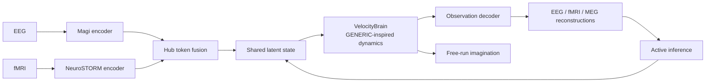

# Brain MoE-PINN: A Learned Generative Dynamical System for Multimodal Brain Data

**A technical introduction for computational neuroscience and bioinformatics researchers.**

Brain MoE-PINN is a multi-hundred-million-parameter model that learns to *generate* brain dynamics from multimodal neuroimaging data — EEG, fMRI, and optionally MEG — while using physics-inspired inductive biases and diagnostics rather than claiming a thermodynamically valid model. Unlike a conventional encoder that maps brain data to a static embedding, this model learns a **velocity field** over a latent state space: given the current brain state, it predicts how the state will *evolve*. This lets it both *represent* brain activity (like a foundation model) and *simulate* its temporal evolution (like a biophysical model). The architecture sits at the intersection of representation learning and dynamical systems theory, targeting a regime — mesoscopic whole-brain dynamics with learned physics — that needs empirical validation.

---

## 1. The Problem: Representation vs. Simulation

Two research traditions dominate computational brain modeling, and they rarely speak to each other.

**Brain simulation** solves differential equations for each neuron or neural population. Projects like The Virtual Brain (TVB) use connectome-based neural mass models at 200–1000 brain regions, supporting in-silico lesion experiments and inference via Dynamical Causal Modeling. At the extreme, spiking network simulations on supercomputers (Hygon Exascale, K Computer cerebellar models) integrate Hodgkin-Huxley equations for billions of neurons. These models are *generative* — you can run them forward without external input — but their parameters are hand-tuned or sampled from priors. They do not learn from data.

**Brain representation learning** trains encoders that map brain recordings to a latent space. BrainLM (2024) applies masked autoencoding to 6,700 hours of fMRI; NeuroSTORM (2026) scales this to 50,000+ subjects using a Shifted-Window Mamba backbone. For EEG, Magi provides a BERT-style encoder with 3D electrode embeddings. These models support decoding and transfer learning, but they do not *generate dynamics* — they produce a static embedding for each time window, with no notion of temporal evolution.

**Brain MoE-PINN bridges this gap.** It combines an encoder stack (representation learning) with a structured stochastic velocity field (simulation), enabling both encoding and generation in a single model. The velocity field uses GENERIC-inspired algebraic candidates—antisymmetry, nonnegative mobility, and pointwise degeneracy projections—as inductive biases. These do not by themselves establish a valid Poisson bracket, stochastic entropy production, or physiological energy/entropy interpretation.

---

## 2. Architecture Overview

The model processes EEG and fMRI simultaneously, with optional MEG — EEG (19–128 channels at 256 Hz), fMRI (400 brain regions at ~0.5 Hz), and MEG (306 channels at 256 Hz, `use_meg=True`) — through a pipeline with five stages:

```
EEG → Magi encoder ──────────┐
fMRI → NeuroSTORM encoder ───┼──→ Hub Token Fusion → z_global
MEG → BERT-medium encoder ───┘ (optional)                        │
                                                                    ▼
                                               Velocity Field (GENERIC + MoE)
                                                                    │
                                                                    ▼
                                               Decoder → EEĜ, fMRÎ, MEĜ (if enabled)
```

### 2.1 Encoders

**EEG — unified Magi backend.** `eeg_backend="v1"` retains the 8-layer,
512-dimensional BERT-medium-style path. `eeg_backend="v2"` selects the native
24-layer, 1024-dimensional Magi path with RoPE, GeGLU, pre-norm blocks,
alternating global/sliding-window attention, channel-type embeddings,
BIOT-style arbitrary electrode positions, variable channel counts capped by
`max_channels`, ECoG/sEEG amplitude normalization, and optional Mamba-2
context expansion. Both backends are selected through canonical
`BrainMoEPINN`/`ExperimentConfig`; there is no separate model class.

**fMRI — NeuroSTORM (frozen backbone).** A Shifted-Window Mamba backbone pretrained on 28.65 million frames from 50,000+ subjects. We freeze the backbone and train only a small adapter projection (~5M parameters). Task-specific Prompt Tuning (TPT) prepends learnable prompt vectors to the token sequence, enabling task-conditioned processing without modifying the backbone weights.

**MEG — Shared BERT-medium backbone (optional).** No pretrained MEG foundation model exists, so we share the EEG encoder's architecture and initialize from EEG weights via `load_from_eeg()`. This is justified by Maxwell's equations: EEG and MEG both arise from the same post-synaptic currents, differing only in measurement physics (volume conduction vs. magnetic induction). Sharing the backbone enforces this physical correspondence. MEG is disabled by default (`use_meg=False`); when enabled, the hub fusion expands from two to three tokens and the decoder gains a MEG reconstruction head.

### 2.2 Hub Token Fusion

Each encoder produces a sequence of token embeddings. Two learnable *hub tokens* — one per active modality (EEG and fMRI by default) — attend to these sequences via cross-attention, producing modality-aligned representations. A final fusion step produces a single global latent state $z_{\text{global}} \in \mathbb{R}^{1024}$ that integrates information from all available modalities. When MEG is enabled, a third hub token is added. The hub tokens are also preserved for downstream decoding.

### 2.3 The Velocity Field: Structured stochastic dynamics

This is the core of the model. Given a latent state $z$, we predict its velocity $\dot{z}$ — how fast and in which direction the state changes:

$$\dot{z} = \underbrace{L(z)\nabla E}_{\text{antisymmetric candidate}} + \underbrace{M(z)\nabla S}_{\text{nonnegative dissipative candidate}} + \underbrace{\text{MoE}(z)}_{\text{learned experts}}$$

**GENERIC-inspired inductive bias.** $E(z)$ and $S(z)$ are learned scalar fields, not physiological energy or entropy. $L(z)$ is constructed to be antisymmetric, while $M(z)$ supplies nonnegative diagonal mobility values learned from the state (a sigmoid gate calibrated so a fresh model reproduces the historical constant mobility). $\nabla E$ and $\nabla S$ are true autograd gradients of the potentials, scaled by learned positive factors — never unit-normalized, since a direction field that is not a gradient voids every degeneracy projection built on it. $L\nabla S$ is removed by a pointwise projector; the mobility is applied through an Öttinger projector $P_E M P_E$ with $P_E = I - \nabla E\nabla E^{\top}/\lVert\nabla E\rVert^{2}$, so the effective dissipative operator satisfies $M\nabla E = 0$ exactly instead of only being penalized toward zero. These properties are useful structural biases, but they do not establish the differential Jacobi identity, a globally valid GENERIC bracket, or stochastic thermodynamic entropy production.

The learned potentials are evaluated by their observable consequences—reconstruction, forecasting, free-run statistics, state transitions, and external behavioral alignment—not by assigning them physical units or physiological meaning.

**The MoE contribution** adds learned complexity. By default (since the 2026-05-16 architecture revision) eight *shared experts* — 2-layer residual MLPs at 1.0× width, ~2.1M parameters each at latent_dim=1024 — are always active, providing a dense backbone. Six *routed experts* (0.7× width, ~1.5M each) are selectively activated via a Top-3 gating mechanism, giving the model the capacity to learn specialized dynamical modes — perhaps one expert for resting-state dynamics, another for visual task processing, etc. The measured default MoE velocity block is ~26M parameters. An opt-in **deep-expert configuration** (`--use_deep_experts`) replaces the shared stack with 50-layer residual MLPs (52.5M each) and the routed stack with 14-layer MLPs (7.6M each), raising …

The router is a **recurrent selective state-space model** (a Mamba S6 core with 64-dimensional hidden state), not a stateless MLP. This is important: expert routing at time $t$ depends on the entire history of latent states $z_{<t}$, not just the current state. A stateful router produces smoother, more contextually appropriate expert allocation. The router's state is a registered PyTorch buffer, surviving device transfers and checkpoint save/load. A temperature parameter $\tau$ controls routing softness, annealed from 2.0 (near-uniform, encouraging exploration) to 0.7 (sharp, encouraging specialization) over the course of training.

**MoE scope: the structure claim holds for the backbone, not for the default experts.** With the default (`use_generic_moe=False`) experts add an unconstrained velocity *after* the degeneracy projections, so the *total* field is not GENERIC even though $L\nabla E + M\nabla S$ is. This is measured, not assumed: `moe_velocity_share` reports the experts' fraction of the applied velocity magnitude and `moe_energy_alignment` reports how strongly that unstructured part couples to $\nabla E$ (a random-init model sits near 0.76 and 0.16 respectively). Ablation predictions in §6 therefore test the *backbone's* contribution. Setting `use_generic_moe=True` makes each expert perturb $L$ and $M$ instead (`delta_L = UJU^\top`, `delta_M = diag(softplus) + VV^\top`, both projected), so the composite field keeps the structure; `configs/species/mouse.json` already enables it. Historically that mode cost 14.4× the plain experts (379M vs 26M parameters at latent_dim=1024); a bottleneck on the low-rank factor maps brought it to 3.7× (96M), which is why it is now a practical option rather than an ablation curiosity.

The low-rank factorization $L(z) = U(z) J U(z)^\top$ reduces parameter count and supplies an antisymmetric geometric bias. Because $U$ is state-dependent, it does not guarantee the Jacobi identity; the optional Jacobi diagnostic requires a differentiable operator and explicit state points and is not enabled for the 1024-dimensional training path. The operator is applied **implicitly**: only $L v = U(J(U^\top v))$ is ever computed ($O(d\,r)$), because the degeneracy projector commutes with the action, $(P_S L P_S)\nabla E = P_S L (P_S \nabla E)$. Materialising $L$ and forming $P L P$ costs two $d\times d$ matmuls per sample and produced bit-identical velocities; `materialize_poisson=True` restores it for diagnostics that need the matrix.

### 2.4 Multi-Time-Scale Dynamics

The velocity field operates at multiple timescales through three mechanisms:

**Multi-Time-Scale KDA (MT-KDA)** — not to be confused with the decoder's Kimi Delta Attention — maintains three parallel exponential moving averages of the velocity with per-step decay rates $\alpha = 0.1, 0.5, 0.9$. When `latent_dt` is supplied these are converted to physical time constants $\tau = -1/\ln\alpha$, i.e. roughly 0.43 s, 1.4 s and 9.5 s at the default alphas. They are latent-state filters spanning a fast/medium/slow decomposition; they are *not* synaptic (~10 ms), working-memory (~100 ms), or hemodynamic (~1 s) time constants, and no biophysical process is being identified. A learned gating network combines the three branches, and the running states are registered as buffers (not optimizer parameters) to avoid polluting the optimizer with mutable state.

**Slow Manifold Projector** extracts sub-0.25 Hz ultra-slow dynamics via a learned 256×1024 projection. This is where cross-modal alignment between EEG and fMRI lives — the fast electrical signals and slow hemodynamic signals meet on this manifold through a physics-structured Latent HRF Bridge.

**OU-Structured Noise and the SDE policy.** Colored (Ornstein-Uhlenbeck) noise is applied according to an explicit `noise_mode` policy — `off | rollout | train | always` (default `off`: deterministic latent steps). The OU state uses the exact discrete recursion $a = e^{-\Delta t/\tau}$ with unit stationary variance, and the noise enters the velocity as $\sqrt{2 D_{eff}/\Delta t}\,\eta$, so the integrated latent increment has the Euler–Maruyama magnitude $\sqrt{2 D_{eff}\Delta t}$ — noise scales with $\sqrt{\Delta t}$, not $\Delta t$. The integrator and the noise share one clock (`integration_dt`, derived from `latent_dt`) by construction. When enabled, the Wiener Homeostat scales $D_{eff}$ for the active mode (tensor-native EMA, periodic update, optional per-component calibration via `calibrate_dim_gain`).

**Stimulus control conditioning.** Loaders may declare control-role modalities (stimulus tracks: salt steps, drifting gratings, temperature gradients, task events); the trainer reduces the windowed control to a per-step perturbation — `(B, K, U)` with `K = rollout_steps` segment means (the default `control_reduction="resample"`), so stimulus timing survives into the latent steps. `control_reduction="mean"` collapses the whole window to a single vector and is only appropriate for stationary controls. `VelocityBrain` then (a) adds a bias-free, zero-initialized control readout (so $u = 0$ is an exact no-op in any trained state) and (b) applies zero-initialized input-conditioned gates — identity at init — that modulate the mobility and arousal terms, letting stimuli reshape dynamics rather than merely offset velocity.

### 2.5 Decoders

The decoder uses **KDA (Kimi Delta Attention)**, a linear-complexity attention mechanism from Kimi (arXiv:2510.26692). Unlike standard softmax attention, KDA uses a delta rule — the attention output is computed as an incremental update to a recurrent hidden state, with per-key-dimension gating for selective state-tracking. This makes it ideal for autoregressive generation: each new token updates the state in $O(d)$ rather than $O(n^2)$. In our architecture, KDA layers are interleaved with standard linear layers in a 1:3 ratio (25% KDA, 75% linear), following the Kimi Linear hybrid design. On CPU, the FLA library's `causal_conv1d` component requires CUDA, so a fallback decoder (`ModalityDecoderRouter`) is available for CPU-only development.

The decoder gate concatenates hub tokens from all active modalities. For a model with EEG + fMRI + MEG enabled, this produces a 3072-dimensional gate input (3 × 1024), enabling cross-modal information to influence reconstruction of each modality.

EEG and fMRI are always reconstructed; MEG is reconstructed only when enabled. The MEG reconstruction loss closes a gradient gap that would otherwise leave the MEG decoder supervised only through the cross-modal hub fusion path.

### 2.6 Active Inference and Imagination

The model operates in two modes:

**Perception mode** processes real sensor data through the encoders. After predicting $z_{t+1}$ via the velocity field, an active inference loop compares the decoder's reconstruction $\hat{x}_{t+1}$ against the actual observation $x_{t+1}$ and corrects the latent state using the prediction error. A GRU-based delay predictor consumes a history of latent states (detached, FP32) to produce the delay-compensated state — a learned predictor in the spirit of a Smith Predictor rather than the classical delay-free-model construction — and a Precision Gate weights corrections by delay and action magnitude (its mapping is learned, not the closed-form exponential).

**Imagination mode** runs the model forward without external input — the velocity field drives the dynamics autonomously. A Counterfactual Tree Search (depth 3, branch factor 4) explores possible futures; a learned trajectory discriminator scores each candidate path and a soft minimum selects one, after which a free-energy-like scalar (`compute_efe`: the negative of the learned value function, plus goal distance and an explicit control cost) is reported to the action loss. **The tree search does not itself optimize EFE**, and that scalar is *not* the variational Expected Free Energy — there is no observation model, no posterior over hidden causes, and no epistemic term. Rollouts run the base velocity backbone only: MoE modulation, stimulus control, species conditioning, and the multi-time-scale filter are not part of the search. The selected trajectory's endpoint then biases the velocity field, creating a closed action-perception loop.

During training, imagination runs on designated steps (controlled by an `imagination_interval` curriculum) to manage computational cost. Imagination components are gated behind a `use_imagination` flag — when disabled, they consume no memory.

### 2.7 Memory Systems

**Hebbian Associative Memory** stores latent states via Oja's rule — a biologically plausible Hebbian update that maintains normalized weights ($W^\top W \approx I$). The engram trace provides a long-term reference for replay loss, comparing imagined states against stored memories. Hebbian weights are spectrally normalized every 100 steps to prevent runaway growth.

A **replay buffer** accumulates imagined states (capacity 256) and provides temporal pairs for replay loss computation. The buffer is cleared alongside other state when `reset_history()` is called at phase boundaries.

### 2.8 Magi v2, ECoG, and cross-modal integration

Magi v2 is a native observation backend, not a second Brain MoE-PINN model.
The implementation is split across the vendored `magi/` package and
`encoders/eeg_encoder_v2.py`:

- The Magi backbone scales to the ModernBERT-large design target
  (24 layers × 1024 hidden dimensions), with RoPE, GeGLU, pre-norm blocks,
  alternating global/sliding-window attention, and tiling initialization from
  the v1 depth.
- Channel-type embeddings distinguish scalp EEG, ECoG grid, sEEG depth, and
  unknown channels. BIOT-style position features support arbitrary electrode
  layouts, while `max_channels` bounds memory use.
- The foundation wrapper also exposes momentum-encoder, masked-prediction,
  contrastive-projection, and adversarial-subject-classifier components for
  standalone Magi pretraining; the canonical BrainMoEPINN forward path uses
  the projected encoder representation.
- ECoG/sEEG amplitudes are normalized before encoding (`1/20` for ECoG grid
  and `1/10` for sEEG depth by default).
- Optional Mamba-2 context expansion and pretrained checkpoint loading are
  propagated through the canonical model lifecycle methods.
  `data/ecog_dataset.py` handles DANDI NWB, EDF, and BIDS inputs, including
  variable channel counts, MNI coordinates, and paired ECoG-fMRI windows.
  `data/ecog_preprocessing.py` provides resampling, filtering, rereferencing,
  z-scoring, bad-channel detection, and coordinate extraction.

The canonical construction path is:

```python
from brain_moe_pinn import BrainMoEPINN

model = BrainMoEPINN(eeg_backend="v2", use_channel_type_embed=True)
```

`configs/species/*.json` and `configs/ladder.json` define the species/data
contract. `train.py` is the only training entrypoint and accepts
either a JSON profile or explicit model flags. The Magi backend, ECoG data
path, MoE routing, context expansion, and multi-step rollout therefore share
one model/configuration surface.

---

## 3. The Loss Function: Physics Through Supervision

`LossWeights` (in `training/training_phases.py`) separates **steering terms** — weights $> 0$, applied with stage-dependent weights — from **monitor/dormant terms** kept at weight 0 so their metrics keep being logged without warping the optimization landscape. All classes remain; no loss was deleted. The steering set per dense stage is:

$$\mathcal{L}_{\text{total}} = \sum_{\ell \in \text{steering}} w_\ell \cdot \tilde{\mathcal{L}}_\ell$$

Where $\tilde{\mathcal{L}}_\ell$ is an EMA-normalized version of each steering loss (mean/std calibrated over 1,000 warmup steps and frozen thereafter). This prevents one loss from dominating due to scale differences. Default steering set (dense stages): EEG/fMRI reconstruction, dissipation proxy, MoE load balancing, grassmannian (single weight on the raw orthogonality emitted by `MoEVelocityField`), spectral slope (the sole 1/f term), band power (band matching only), cross-modal alignment, HRF bridge, and SIGReg anti-collapse. Stage 3 additionally steers action (EFE) and replay. Monitored at weight 0: dissipative form, latent concentration, Hebbian weight norm (logged every step); the degeneracy constraint is enforced by projection rather than by its weight (see below); Jacobi (diagnostic), velocity smoothness and velocity-difference (need rollout sequences), NSP (band-power clone of bandpower until implemented as latent→statistics prediction), tsallis (dormant; sign bug rewards concentration), cross-soft (hub contrastive; trainer never supplies labels), Hebbian regularization (Oja already controls its norm), recon_meg (wired; enable once the trainer feeds MEG batches).

**Reconstruction losses** (EEG, fMRI, MEG): Standard MSE between decoder output and input signal. These are the primary training signal — all other losses are auxiliary.

**Structured-dynamics losses:**
- *Degeneracy constraint*: pointwise residuals in $L\nabla S$ and $M\nabla E$. These are **enforced by projection, not by penalty**, so the residual is identically zero and `generic_constraint` carries weight 0 in every phase: $(P_S L P_S)\nabla S = P_S L (P_S \nabla S) = 0$ because $P_S \nabla S = 0$, and likewise $(P_E \mathrm{diag}(M) P_E)\nabla E = 0$. The weight only becomes live if `apply_degeneracy_projection` is disabled. It remains a local algebraic statement, not a proof of global GENERIC validity or of the Jacobi identity.
- *Jacobi diagnostic*: requires derivatives of a callable Poisson map and explicit state points. It raises an error when those inputs are absent rather than reporting a false score; it remains disabled for the high-dimensional training path.
- *Grassmannian regularization*: encourages expert attractor subspaces to be orthogonal, preventing expert collapse.

**Dissipative proxies:**
- *Dissipation*: penalizes decreases in the learned scalar field $S$ along the total model update. Since the update also contains conservative, learned-bias, and noise terms, this is an entropy-potential change proxy.
- *Dissipative form (monitor, no longer a loss)*: reports $\nabla S \cdot M(z)\nabla S / D$, the quadratic form of the mobility along the entropy gradient, plus the mobility's mean and minimum. It is worth watching because it collapses to zero exactly when the mobility dies. It **cannot** be a steering term: $\sigma \ge 0$ for any PSD $M$, so the old `relu(-\sigma)` penalty was identically zero and its weight could never fire. It is also not a pathwise stochastic entropy-production rate — that would need the Ito/divergence term $\nabla\cdot(M\nabla S)$.

**Spectral losses:**
- *Band-power loss*: Compares power in five frequency bands (delta/theta/alpha/beta/gamma, 0.5–50 Hz) between reconstructed and real EEG. This enforces frequency-domain fidelity beyond pixel-level MSE. Band matching only: the built-in 1/f estimator is gated behind `include_one_over_f=True` (standalone/ablation) because the spectral slope loss below is the single 1/f authority.
- *Spectral slope loss*: Constrains the **aperiodic exponent** of reconstructed EEG and MEG. In the default data-driven mode the reference is the target signal's own exponent, estimated with the same peak-robust estimator, so the model reproduces whatever aperiodic structure the recording actually has — including the flattened exponents reported in epileptogenic tissue and seizure-onset zones (changes in 1/f-like scaling are a documented spectral biomarker there). A *fixed* pink target of $-1$ is the wrong objective for that reason: deviations from 1/f are the signal of interest, not an error to be penalised, and the exponent additionally varies with subject, cortical region, state, and the fitting range. `target_slope` (default $-1.0$) remains available as an explicit standalone/ablation fallback. The estimator is an iteratively reweighted log-log regression that rejects oscillatory peaks before the final fit, because peaks sit above the aperiodic background and bias a naive least-squares line — the specparam comparison reports Cohen's $d \approx 2.3$ between naive and peak-aware fitting. Operates on the reconstructed signal (not latent states) because 1/f is an observable signature, not a dynamical invariant. Requires at least 16 temporal samples; shorter sequences return zero loss and the fitting range is reported in the metrics. fMRI is excluded: the BOLD signal lives at 0.01–0.1 Hz, a different timescale where these constraints do not apply. Per-window exponents are logged (`psd_slope`, `psd_slope_reference`), which is the right artifact if the goal is *detecting* exponent shifts rather than enforcing them.

**Why spectral constraints operate on reconstructed signals, not latent states.** We initially tracked a rolling buffer of latent states (`z_sequence`) and computed the spectral slope over this trajectory. This was incorrect for two reasons: (1) the buffer mixed states from 128 different batches/subjects, and computing the PSD of a mixed sequence is mathematically meaningless; (2) the 1/f property is an observable signature of neural signals, not a guaranteed property of latent dynamical trajectories. The corrected approach computes spectral constraints on the decoder output — the actual signal a neuroscientist would measure — which is where neurophysiological constraints properly belong.

**Auxiliary losses:**
- *NSP (Neurodynamics Statistics Prediction)*: Predicts band powers and functional connectivity from latent representations, inspired by the DeeperBrain model. Monitor/dormant at weight 0: the current implementation only matches band powers between reconstruction and target, duplicating the band-power loss; re-enable after implementing the latent→statistics prediction head.
- *Cross-modal alignment*: Cosine similarity between active hub tokens (EEG/fMRI by default; MEG included when enabled). The class also implements a labeled mode (sync vs. async pairs) that subsumes the old soft-contrastive term; `cross_soft` is dormant at weight 0 because the trainer does not yet supply `cross_modal_labels`.
- *Velocity smoothness*: Dormant at weight 0. The current implementation takes the TV over the *batch* axis of single-step `delta_z`, which shrinks inter-sample velocity diversity rather than enforcing temporal smoothness. Reactivate only as true temporal TV once rollouts emit `delta_z_sequence`.
- *MoE load balancing*: Encourages uniform utilization across routed experts, preventing a single expert from dominating.
- *Hebbian regularization*: Dormant at weight 0; Oja's rule already keeps $W^\top W \approx I$, and its input is detached `.data` (no gradient). The weight norm is logged as a monitor; spectral control happens through the periodic normalization pass in the training loop.
- *Latent concentration (tsallis)*: Dormant at weight 0; SIGReg is the chosen anti-collapse term. The sign bug that rewarded concentration is fixed, so the term now penalises peaked softmax latents as intended and its monitor reads `latent_concentration`.
- *Action loss*: Minimizes Expected Free Energy for active inference; active in Stage 3 when imagination is enabled.
- *Replay loss*: Compares imagined states against engram traces for memory consolidation; active in Stage 3.

---

## 4. Training Strategy

### 4.1 Phased Curriculum

Training proceeds through a single continuous run with nine sub-phases, progressively introducing complexity. No checkpoint save/restore gaps — the schedule is continuous.

| Phase | Tokens | Key Changes |
|-------|--------|-------------|
| **P0 (warmup)** | 0–0.8B | Encoder warmup. Magi EEG+MEG encoder trained from scratch or loaded from Phase -1. Backbone frozen after warmup. |
| **P1** | 0.8–30B | Alignment + routing differentiation (τ=2.0). NSP + modal_align + meg_align active. Physics losses are **monitoring-only** (weight=0). |
| **P2** | 30–60B | Dissipation (`L_dissip`) + spectral losses activated. NSP decays. Physical constraints begin guiding dynamics. |
| **P3** | 60–90B | TV weight decay 0.1→0.02. Dissipation proxy active. |
| **P4** | 90–120B | Router temperature tightens (2.0→0.7). EMA startup. Expert specialization begins. |
| **P5** | 120–200B | Full physics-inspired constraint suite. Energy-change + Landauer diagnostics. Trajectory diagnostics audited; no stochastic EPR claim. |
| **P6** | 200–260B | Long context (seq=4096). Async cross-modal contrastive (`L_cross_soft`) + slow manifold projection. |
| **P7 (Stage 2)** | 260–334B | Seq→16384. Mamba-2 SSM. Full latent HRF bridge (`L_cross`). Adafactor switch. Grassmannian + Waddington. |
| **P8 (Stage 3)** | 334–364B | Shared experts frozen. Hebbian Oja + online assimilation. Imagination 50%. Seq returns to 4096. |

> **Phase -1** (Magi encoder standalone pretraining, ~800M tokens) is optional. If skipped, P0 trains the encoder from scratch.

**Total**: ~364B tokens, ~74 days on 64× V100 (16 nodes × 4 GPUs) at ~14.5% effective MFU.

### 4.2 Why MoE From the Start (No Dense Pretraining)

Standard practice in MoE models (e.g., Mixtral) pretrains a dense model and then converts to MoE. MoE scaling laws (Krajewski et al., 2024; Ludziejewski et al., 2025; Zhao et al., 2025) show this is unnecessary for our scale: starting with E=4 MoE from step 1 requires 16B tokens, while dense initialization would need 140B tokens — infeasible on our hardware. We start with 8 shared + 6 routed experts directly, with a temperature curriculum that encourages broad exploration early and sharp specialization later.

### 4.3 Hardware and Distributed Training

- **64× NVIDIA V100 16GB SXM2** (16 nodes × 4 GPUs)
- **DeepSpeed ZeRO-2**: Gradients and optimizer states sharded across data-parallel nodes (~0.88 GB/GPU)
- **Mixed precision**: FP16 compute with selective FP32 casting for numerically sensitive operations (router, Hebbian, KDA state accumulation). Non-CUDA backends (Intel XPU, Huawei Ascend NPU, Moore Threads MUSA, Cambricon MLU) default to FP16 in autocast (Ascend NPU is not bf16-friendly).
- **Device-agnostic design**: All device references are centralized in `runtime/device_utils.py` with auto-detection priority CUDA→XPU→NPU→MUSA→MLU→CPU. No hardcoded `torch.cuda` or `.cuda()` calls outside this module.

### 4.4 MoE-aware token and data plan

The current planning baseline is MoE-aware rather than dense-Chinchilla:

| Stage | Active-parameter assumption | Planned tokens |
|---|---:|---:|
| Stage 0 | E=4 MoE, approximately 2B active parameters | 16B |
| Stage 1 | Shared latent dynamics + multimodal adapters | 18B |
| Stage 2 | Long-context Mamba-2 + cross-modal bridge | 20B |
| Stage 3 | Frozen shared experts + online assimilation | 13B |
| **Total** | — | **~67B** |

These are training-planning targets, not measured throughput or convergence
results. The rationale is that dense Stage 0 would require roughly 140B tokens,
whereas starting with MoE reduces the initial budget and preserves the
specialization objective.

The cross-modal inventory is organized around:

- ECoG/iEEG: AJILE12 (`DANDI:000055`), synchronized iEEG-fMRI
  (`DANDI:000623`), scalp+iEEG (`DANDI:000574`), and PtNRGrids
  (`DANDI:000465/000554`).
- fMRI: UK Biobank, HCP, ABCD, and HBCD, with HBCD treated as separate
  protocols rather than simultaneous EEG-fMRI recordings.
- Low-resolution EEG: TUH EEG, LEMON, and MPI-Leipzig.

Dataset sizes and token counts remain acquisition/planning estimates until the
corresponding files are downloaded, standardized, and measured locally.

---

## 5. Stability and Monitoring

Training a ~770M-parameter model (default) with a ~12-term steering loss stack, monitored auxiliary terms, and physical constraints requires layered defenses:

**Seven-layer stability defense:**
1. KDA state L1 normalization every 64 steps
2. Pointwise degeneracy projection every step
3. Kahan summation for floating-point accumulation
4. Stable softmax (subtract max before exp)
5. Hebbian spectral normalization every 100 steps
6. EMA monitoring of observable control proxies and router entropy
7. Energy audit: track total energy-like field output for divergence

**AutoRollback** (`training/stability.py`) uses explicitly named diagnostics: (1) negative signed-work ratio when a trajectory diagnostic is supplied; (2) energy-like divergence; and (3) router entropy collapse. The first trigger is not an entropy-production estimate. A fourth trigger keyed on a `ks_entropy` metric was removed: nothing ever emitted that key, so it could not fire.

**Wiener monitors** run at a fixed cadence (default: every 10 training steps, `monitor_interval` on BrainMoETrainer) and only in training mode, so evaluation stays history-independent. They regulate stochastic noise only when explicitly enabled; their setpoints are control targets, not universal criticality observables.

### 5.1 Key Fixes for Training Stability

During development, several stability-critical issues were identified and resolved:

**State management.** Two components stored mutable running state as plain Python attributes or `nn.Parameter` tensors — patterns that fail under `.to(device)`, `state_dict()`, or distributed training. The **PoissonSSMRouter's recurrent SSM state** (which accumulates temporal context for expert routing) and the **MultiTimeScaleKDA's three timescale states** (which maintain fast/medium/slow velocity averages) were both converted to registered PyTorch buffers with in-place `.data` updates. This ensures they survive device transfers, appear in checkpoints, and are properly synchronized across distributed workers.

**Imagination timing.** The joint perception-imagination forward pass (which closes the action-perception loop by running CFTS and EFE computation inside perception mode) was accidentally duplicated — the code block appeared twice, causing CFTS to run twice per step. The duplicate was removed, leaving a single coherent path. Additionally, the `_imagination_active` flag that controls whether imagination runs on a given step was being set *after* the forward call, creating a one-step lag and incorrectly activating imagination on step 0. It now executes before the forward pass, ensuring the flag reflects the current step.

**Dimension hygiene.** The `action` tensor passed to the active inference loop was hardcoded at 2048 dimensions while the latent space is 1024-dimensional. This was fixed to match. In the Poisson router, the standard Mamba S6 discretization $B\Delta = \Delta \cdot B_{\text{proj}}(z)$ was incorrectly written as $B_{\text{proj}}(z) \cdot \Delta.\text{unsqueeze}(-1)$, causing a broadcast failure when batch and state dimensions collided.

---

## 6. Validation and Testable Predictions

The model makes specific, falsifiable predictions that can be tested through ablation experiments:

| Component | Prediction | Test |
|-----------|-----------|------|
| Degeneracy projection | Disabling $L\nabla S = 0$ or $M\nabla E = 0$ causes trajectory instability | Delta-z Frobenius norm growth > 2× |
| Grassmannian regularization | Without it, expert subspaces collapse (become non-orthogonal) | Off-diagonal Gram norm increases |
| Poisson conservative term | Without it, EEG PSD flattens (loses oscillations) | 1/f slope drops below 0.5 (healthy: 0.8–1.2) |
| SSM router vs. MLP router | Recurrent routing reduces expert switching frequency | Switching frequency < 0.5× MLP baseline |
| Band-power + spectral slope loss | Models without these fail to reproduce correct spectral profiles | Per-band MSE; alpha suppression ratio |

**Baseline comparisons** against four simplified architectures (VAE+Neural ODE, Graph Neural ODE, No-hub-token fusion, Transformer trajectory model) on five metrics (reconstruction MSE, PSD slope fit, FC correlation, parameter count, throughput) determine whether each complex component provides net benefit.

---

## 7. Design Principles

Several design choices distinguish this project from conventional deep learning architectures:

**Forward-increment parameterization.** The model predicts a latent increment $\Delta z$ rather than directly emitting $z_{t+1}$. This is an architectural choice that supports causal forecasting; it does not prove microscopic irreversibility, prevent time-reversal analysis, or establish a nonequilibrium steady state.

**Physics-inspired structure, not a theorem.** The forward pass combines antisymmetric and dissipative candidate terms, pointwise degeneracy projections, and stochastic-noise modules. Loss terms and diagnostics reinforce these inductive biases, but they do not establish a valid GENERIC or metriplectic system without separate bracket, stochastic-process, and empirical validation.

**Emergence paradigm.** In Stage 1 P1, all physics losses have zero weight. The model is expected to self-organize through reconstruction pressure and MoE routing competition — complex dynamics should emerge from simple objectives. Physics losses are gradually activated from P2 onward, acting as guardrails rather than hand-holding.

**State is explicit, not hidden.** All temporal state in the model — the router's SSM state, the KDA timescale states, the Hebbian weight matrix, the replay buffer — is registered as named PyTorch buffers. Nothing is stored as a plain Python attribute that would be lost on `.to(device)` or checkpoint save. This is a deliberate engineering choice, not just a fix: in a model where temporal continuity is essential, losing state is losing the computation.

---

## 8. Current Status and Limitations

**What works (verified by smoke tests on CPU; re-verified in the 2026-09 checkout):**
- Full forward and backward pass — parameter totals are configuration-dependent. The `magi` encoder is vendored in-repo but needs the `transformers` package (absent from the local dev venv), so end-to-end totals could not be re-measured locally (2026-09); re-measure at first cluster launch. Measured in this checkout: MoE velocity block = 25.6M (default shallow experts) / 466.1M (`--use_deep_experts`). Historical smoke-test figures (~770M default / 147M reduced) date from the pre-revision deep-expert-default architecture (2026-05).
- All steering loss terms compute correctly, including the spectral slope loss on reconstructed EEG/MEG; dormant terms are exercised in monitoring/ablation mode (2026-09)
- Gradient flow verified across all components (encoder stack, velocity field, MoE, decoder)
- Router state persists correctly across forward calls and resets
- Multi-Time-Scale KDA states update correctly as buffers
- Spectral slope guard correctly returns zero loss for sequences with fewer than 16 temporal samples

**Known limitations:**
- The KDA decoder uses `causal_conv1d` from the Flash Linear Attention (FLA) library, which requires CUDA. A fallback decoder is available for CPU development.
- The training loop currently passes `actual_eeg` as a slice of the *input* EEG, not data from time $t+1$. True online active inference requires a paired-sequence dataloader.
- Pretrained NeuroSTORM and BrainLM weights need to be downloaded (loading infrastructure is in place).
- Velocity smoothness sits at weight 0 until sequence-level training (multi-timestep batches) emits `delta_z_sequence`; it now takes true temporal TV and returns zero for single-step input. The misnamed `ks` / velocity-difference regularizer was deleted (it was 0.0 in every phase and duplicated this term).
- The 1/f constraint now lives in exactly one place (SpectralSlopeLoss); BandPowerLoss's built-in estimator is gated behind `include_one_over_f=True` for standalone ablation only.

### Controlled dynamics and causal validation

`VelocityBrain` and the canonical `BrainMoEPINN` model accept an optional
`perturbation`/control tensor when constructed with `perturbation_dim`. This
adds an explicit learned control term to the latent velocity. The interface
supports intervention-response experiments, but conditioning on a perturbation
does not itself identify causality; valid intervention timing, controls,
randomization or another identification strategy, and subject-held-out
evaluation are still required.

`diagnostics/causal_dynamics.py` provides controlled rollouts,
treated-versus-baseline response metrics, and forward/reverse prediction gaps.
These are operational temporal-asymmetry diagnostics, not thermodynamic
irreversibility proofs.

`physics.stochastic_process` defines the controlled-SDE contract, Euler-Maruyama
steps, Gaussian transition likelihoods, and conditional forward/reverse path
log ratios. A total path entropy-production value is returned only when the
caller supplies both boundary log densities and a correctly specified reverse
process, including parity handling for odd variables.

Jarzynski/Hatano-Sasa protocol estimators and stronger global Poisson/GENERIC
construction are intentionally deferred until controlled datasets and
physically anchored state/process definitions are available.

### Unified model and cross-species data ladder

There is one canonical implementation: `BrainMoEPINN` in `__init__.py`.
Magi v2, ECoG/sEEG channel metadata, and multi-step rollout are native
capabilities of that model; there is no separate v2 model or compatibility
entrypoint.

Species profiles live in `configs/species/*.json`, with the ordered replay
contract in `configs/ladder.json`. Each profile specifies modalities, sampling
units, channel/region bounds, feature gates, and leave-subject-out training
metadata. Species conditioning is metadata conditioning only; it is not a
claim that channels or regions are anatomically homologous across species.

For calcium, voltage, widefield, behavior, and other variable-channel inputs,
call `BrainMoEPINN.forward_modalities` with a mapping of modality names to
`(B, channels, time)` tensors. This path runs the shared latent dynamics with
explicit multi-step rollout. It does not fabricate EEG/fMRI reconstruction
targets for species that lack them; instead, with `reconstruct=True`, any
modality within `recon_max_channels` is encoded channel-wise
(`ChannelSignalAdapter`) and decoded back to its raw sampling grid
(`SignalReconstructionHead`, which generates the waveform from the evolved latent), emitting
`{modality}_recon` keys. Supervise those with `LossWeights.recon_extra`
(e.g. `{"calcium": 1.0}`), which `TotalLoss` applies through the same generic
reconstruction registry as `recon_eeg`/`recon_fmri`/`recon_meg`. Human
EEG/fMRI/MEG reconstruction remains available through the standard
`forward(eeg, fmri, ...)` path. A generic profile must not call that path;
`generic_observation_only` models raise a clear error and require
`forward_modalities`.

The canonical model lifecycle surface is intentionally small:

- **Used by production code:** `set_training_step()` (encoder freeze/thaw),
  `set_context_length()` (progressive context expansion),
  `load_pretrained()` (CLI checkpoint loading), and
  `reset_router_state()` (phase-boundary state reset).
- **Retained as useful model operations:** `forward_modalities()`,
  `reset_history()` (clears replay/KDA/active-inference state), and
  `get_num_params()` (configuration diagnostics).
- **Removed after consolidation:** `compute_loss()` duplicated the trainer's
  `TotalLoss` call and had no caller; `BrainMoEPINNConfig.from_dict()` and
  `.to_dict()` duplicated serialization already owned by `ExperimentConfig`.
  Loss computation and config serialization now have one authoritative path.

The canonical training entrypoint is `train.py`; it accepts
`--config configs/species/human.json` plus explicit Magi v2/ECoG options.
This is a breaking consolidation: old model-module imports and the former
split training entrypoint are intentionally removed.

**Hardware requirements:**
- 64× V100 16GB SXM2 (16 nodes × 4 GPUs) for full-scale training
- DeepSpeed ZeRO-2/3 with torchrun elastic training
- ~74 days estimated training time at full scale

### Magi v2 readiness and validation

Implemented in this checkout:

- Canonical `BrainMoEPINN` construction with Magi v1/v2 backend selection.
- ECoG/sEEG channel metadata, amplitude normalization, variable-channel
  handling, and ECoG preprocessing/dataset adapters.
- MoE-from-Stage-0 configuration and unified JSON species/data-ladder
  profiles.
- Multi-step latent rollout, context expansion, pretrained-weight loading
  hooks, and a single `train.py` entrypoint.

Operational work still required before claiming cluster-scale readiness:

- Download and validate NeuroSTORM, BrainLM, and Magi checkpoints.
- Acquire priority DANDI datasets, starting with synchronized iEEG-fMRI
  (`DANDI:000623`) and AJILE12 (`DANDI:000055`).
- Re-measure end-to-end memory and throughput for the selected Magi/MoE
  configuration; update DeepSpeed ZeRO settings accordingly.
- Run multi-node forward/backward, checkpoint-resume, and elastic-recovery
  tests on the target topology.
- Run Magi Phase -1 pretraining or explicitly document that P0 trains the
  encoder from scratch.

Validation is considered meaningful only when it covers reconstruction loss,
gradient flow, router behavior, free-run stability, spectral fidelity,
cross-modal alignment, parameter/memory budgets, and throughput. The
architecture summary's predicted gains are hypotheses for those ablations,
not results already established by this repository.

---

## 9. Literature context and research directions

This section consolidates the project's literature review and research
brainstorm. It is an engineering research note, not a publication-ready
systematic review; external claims and quantitative comparisons still require
source verification before publication.

### Brain simulation, representation learning, and hybrid models

**Brain simulation** builds a generative forward model whose dynamics produce
observable neural or behavioral data. It supports inference when observations
are used to estimate hidden states and supports in-silico experiments.
**Brain representation learning** maps recordings to latent embeddings. It is
useful for decoding and transfer learning, but the encoder alone does not
generate neural dynamics. Brain MoE-PINN combines representation-learning
encoders with a generative latent dynamical core and active inference.

#### Brain simulation with inference

Spiking simulations solve neuron-level ODEs and communicate through spike
events. Their cost scales with neurons and synapses, making them memory-bound
and dependent on large supercomputers.

| Project | Scale | Hardware | Model type | Inference | Validation |
|---|---|---|---|---|---|
| BlueGene cortical column (2005–07) | ~1 mm³ cat cortex | IBM BlueGene/L, 128K CPUs | Hodgkin–Huxley spiking | No | Resource metrics |
| K Computer cerebellum (2012–15) | Cat-to-human scale | Fujitsu K, 82,944 CPUs | Izhikevich spiking + OKR | No | Firing-rate comparison |
| Hygon exascale brain (2022–26) | 86B neurons, 47.8T synapses | Hygon prototype, 14,012 GPUs | Conductance-based + Bayesian inference | Yes, EnKF/PF | BOLD comparison |
| PEZY-SC cerebellum (2017) | Human scale | PEZY Shoubu | Izhikevich spiking | No | OKR behavior |

The Hygon approach is particularly relevant because it adds a Bayesian
inference layer over a spiking simulation. An observation operator maps hidden
neural states to BOLD observations, and a particle filter or Ensemble Kalman
Filter estimates the hidden trajectory. This is a useful reference for future
latent-state assimilation in Brain MoE-PINN.

Limitations of this class include phenomenological detail at extreme compute
cost, hand-tuned or prior-sampled parameters, inference overhead, and limited
validation against realistic behavioral tasks.

#### Neural mass and mean-field models

| Project | Scale | Inference | Validation |
|---|---|---|---|
| The Virtual Brain (TVB) | Whole brain, 200–1,000 regions | DCM and source imaging | Functional connectivity, resting-state networks |
| Dynamic Causal Modelling (DCM) | Small regions, 2–10 | Variational Bayes | Task-evoked responses |
| Jansen–Rit neural mass | Single region to whole brain | Limited | Spectral matching |

TVB is the closest conventional analogue to the project. Both operate at
population scale and evolve latent states, but TVB uses fixed biophysical
models while Brain MoE-PINN learns GENERIC-inspired potentials from data.

#### Procedural connectivity

Procedural-connectivity work computes synaptic weights from coordinates and
distance rules instead of storing large connectivity matrices. The approach
trades memory for computation and is well suited to GPUs. Brain MoE-PINN takes
the same philosophy to latent dynamics: its computation is generated from
learned energy, entropy, mobility, and Poisson candidates rather than stored
as a neuron-level connectome.

#### Brain representation learning

| Model | Architecture | Data | Task |
|---|---|---|---|
| BrainLM | Transformer masked autoencoder | Large-scale fMRI | Masked prediction and network identification |
| NeuroSTORM | Shifted-Window Mamba | 28.65M frames, 50K+ subjects | Masked autoencoding, redundancy dropout, prompt tuning |
| fMRI-PTE | Patch-based ViT | HCP | Contrastive learning |
| Magi | 12-layer Transformer, 768d | EEG | Masked prediction, MoCo, PSD, subject invariance |
| BIOT | BERT with 3D electrode embeddings | EEG/MEG | Transfer learning |
| Brain-OF | Flexible-resolution sampling | EEG | Montage-flexible classification |
| DeeperBrain | Transformer + NSP | EEG | Neurodynamics-statistics prediction |

NeuroSTORM demonstrates the value of linear-complexity shifted-window
processing, redundancy dropout, and parameter-efficient prompt tuning. Magi
is the closest EEG foundation-model reference. DeeperBrain's NSP objective
inspired prediction of power spectra, functional connectivity, and
cross-frequency coupling from latent representations.

These encoders produce representations; they do not, by themselves, generate
future brain activity or support latent-state inference.

#### Multimodal fusion

| Model | Fusion method | Role in this project |
|---|---|---|
| Brain Harmony | Hub-token cross-attention | Reference for modality-identity tokens |
| CineBrain + CineSync | Multimodal fusion encoder + neural latent decoder | Candidate synchronous EEG–fMRI data and downstream comparison |

Hub tokens carry modality identity while allowing all active modalities to
interact in a shared latent space. CineSync reconstructs video from brain
signals but does not model autonomous neural dynamics; its temporal structure
comes from the video target.

#### Hybrid approaches

Very few systems bridge representation learning and generative dynamics:

- **CineBrain + CineSync** provides synchronous EEG–fMRI data and a
  multimodal decoder, but not a learned brain-state dynamical system.
- **Spisak and Friston** motivate attractor emergence, orthogonalized
  representations, asymmetric couplings, and non-equilibrium steady states
  from Free Energy Principle objectives. This informs the project's
  Grassmannian attractor regularization.
- **Metriplector** treats metriplectic dynamics as a computation primitive.
  Its conservative Poisson and dissipative entropy-gradient split parallels
  the GENERIC-inspired structure used here, although its scope is broader
  than neuroscience.

The Brain MoE-PINN architecture is:



The project is a learned generative dynamical system at mesoscopic brain-region
scale:

1. **Encode** multimodal observations into a shared latent state.
2. **Evolve** the state with structured stochastic dynamics.
3. **Correct** the state through prediction error and active inference.
4. **Imagine** counterfactual trajectories without observations.
5. **Learn** the observation model and dynamics end to end.

| Dimension | Spiking simulation | Neural mass / TVB | Foundation encoder | Brain MoE-PINN |
|---|---|---|---|---|
| Generative dynamics | Yes | Yes | No | Yes |
| State inference | Some Bayesian approaches | DCM and variational methods | No | Active inference |
| Learns from data | Usually no | Parameter fitting | Yes | Yes, end to end |
| Physical constraints | Biophysical equations | Neural-mass equations | None | GENERIC-inspired algebraic biases |
| Free-run imagination | Yes | Yes | No | Yes |
| Multimodal | Usually limited | Usually limited | Modality-specific | EEG + fMRI + optional MEG |
| Mixture of experts | No | No | No | Yes |
| Online adaptation | Limited | Limited | No | Hebbian memory + active inference |

The closest conceptual analogue is TVB combined with DCM: a dynamical core
with inference. The key distinction is that Brain MoE-PINN learns both the
dynamics and observation model, scales the dynamics through MoE experts, and
adds explicit stability and monitoring mechanisms.

### Candidate research extensions

#### Ensemble Kalman filtering over latent dynamics

Replace gradient-only active-inference correction with a latent-space EnKF.
Maintain an ensemble of latent states $z_t^k$, forecast each through
`VelocityBrain`, decode each member into observations, and update the ensemble
when EEG or fMRI observations arrive.

Potential benefits:

- Per-dimension uncertainty for constrained and imaginative latent directions
- Natural handling of EEG/fMRI temporal-resolution mismatch
- A Bayesian objective based on marginal likelihood rather than MSE alone

The main cost is $N$ forward passes per latent step. An ensemble of 16 members
would require approximately 16 forecasts before parallelization.

#### Connectome-conditioned GENERIC operators

Condition the learned Poisson and mobility candidates on a subject-specific
structural-connectivity prior $S$:

```python
# Current: operators depend on z only
L_z = poisson_op(z)

# Proposed: operators also depend on structural connectivity
L_z = poisson_op(z, condition_s)
```

A learned adapter could project a DTI tractography matrix into the latent
dimension and inject it into the operator computation. This would support
zero-shot subject personalization, artificial lesioning of $S$, and direct
structure–function validation.

#### Model lesioning for causal tests

Selective component ablations can test whether model subsystems have
interpretable functional roles:

- Drop selected experts and measure brain-state switching
- Remove the antisymmetric $L(z)$ candidate and inspect dynamics
- Ablate salience-gated experts and measure transition detection
- Compare reconstructed spectra, ERPs, band power, and connectivity with
  lesion-related observations

A concrete prediction is that removing Core Shared experts should disrupt
resting-state functional connectivity more than task-specific responses,
while removing Specialized experts should produce the opposite pattern.

#### Low-rank procedural Poisson operators

Replace a dense $2048 \times 2048$ Poisson candidate with a low-rank
factorization:

$$
L(z) = U(z) J U(z)^\top -
       \left(U(z) J U(z)^\top\right)^\top
$$

where $U(z)$ is a learned $2048 \times 64$ projection and $J$ is a fixed
$64 \times 64$ symplectic matrix. This reduces the operator parameterization
from roughly 4M entries to approximately 131K and constrains conservative
dynamics to a lower-dimensional subspace. Antisymmetry still does not imply
the Jacobi identity.

#### Invariant-based stress-energy readout

Use learned conserved-quantity candidates as decoder features:

- $E(z)$ and $S(z)$
- Casimir-like invariants
- $\|L(z)\|$ and $\|M(z)\|$

For example:

```python
eeg_recon = decoder(z, E=z_energy, S=z_entropy, L_norm=l_norm, M_norm=m_norm)
```

This is a speculative inductive bias, not evidence that the learned fields are
physical energy or entropy.

#### Cross-frequency coupling validation

Validate reconstructed EEG with neurophysiological metrics in addition to MSE:

- Delta, theta, alpha, beta, and gamma band-power modulation
- Phase–amplitude coupling
- Spectral coherence
- Task-linked alpha suppression or other stimulus-specific signatures

A possible auxiliary objective is:

$$
L_{\text{band}} =
\left\|\operatorname{BandPower}(\hat{x}) -
\operatorname{BandPower}(x)\right\|^2
$$

#### Multi-rate assimilation

Use a two-time-scale assimilation process:

- Assimilate EEG at every fast latent step
- Assimilate fMRI only when a slow observation is available
- Apply hemodynamic-delay handling to fMRI observations
- Free-run when neither observation is available

This would force the latent state to remain stable during fMRI gaps while
allowing rapid EEG corrections.

#### Free-energy-driven attractor ablation

Train variants with and without Grassmannian regularization, then measure
whether expert attractors orthogonalize naturally. If orthogonalization
persists, the explicit regularizer may be redundant. If it disappears, the
result distinguishes an emergent training effect from an explicit inductive
bias.

### Research-extension priority matrix

| Idea | Impact | Effort | Novelty | Priority |
|---|---|---|---|---|
| EnKF over latent dynamics | Very high | 2–3 weeks | High | P0 |
| Low-rank Poisson operator | High | 1 week | Medium | P1 |
| Model lesioning | High | 1 week | High | P1 |
| Cross-frequency validation | High | 1 week | Medium | P1 |
| Connectome-conditioned dynamics | Very high | 2–3 weeks | Very high | P2 |
| Multi-rate EEG/fMRI assimilation | High | 2 weeks | High | P2 |
| Stress-energy readout | Medium | 2 weeks | Very high | P3 |
| Free-energy attractor ablation | Medium | 3 days | High | P0 quick check |

The existing decoder implementation is documented in
`decoder/kda_decoder.py`. The KDA mechanism is a linear-complexity attention
component used for autoregressive reconstruction. XMMM Consciousness Algorithm
is retained as a speculative control-theoretic comparison, not as a validated
model dependency.

---

*Code: development checkout in Google Drive (`マイドライブ/a/brain_moe_pinn`, self-contained, git-tracked); canonical HPC path `/home/yanlu/Documents/a/brain_moe_pinn/`.*
*Fundamental principle: Model velocity $\Delta z$, not absolute position. Irreversibility is a feature, not a bug.*


---
## Project Status

*Canonical implementation: one `BrainMoEPINN` model, one training entrypoint
(`train.py`), unified JSON experiment profiles. This section is the current
status only (consolidated 2026-09); earlier per-session change logs and the
removed design documents live in git history.*

### Verified current surface

**Model and entrypoints**
- Single canonical `BrainMoEPINN` + `ExperimentConfig`/`BrainMoEPINNConfig`;
  `configs/species/*.json` profiles, `configs/ladder.json`, `config.py`
  species/modality contracts (metadata conditioning, not anatomical
  homology claims).
- `train.py` is the only training entrypoint: Magi v1/v2 backends, ECoG
  datasets, MoE-from-stage-0, Mamba-2 context expansion, species
  conditioning, pretrained-weight CLI (`--eeg_checkpoint`,
  `--fmri_checkpoint`; files not yet downloaded).
- Multi-node launchers at repo root (`brain_moe_launch.sh`,
  `brain_moe_multinode.sh`, `launch_all_nodes.sh`), DeepSpeed ZeRO-2/3
  configs, phased curriculum and optimizer transitions in
  `training/training_phases.py`.

**Encoders**
- EEG: unified Magi backend - v1 (8L x 512d) and v2 (24L x 1024d, RoPE,
  GeGLU, alternating global/SWA attention, tiling init) with BIOT-style
  electrode embeddings, channel-type embeddings (scalp/ECoG/sEEG),
  ECoG amplitude normalization, and `max_channels` bounds.
- fMRI: NeuroSTORM shifted-window-Mamba backbone (frozen) with TPT prompt
  tuning; BrainLM fallback; `load_pretrained()` infrastructure.
- MEG: shared BERT-medium backbone with EEG, `load_from_eeg()` transfer;
  optional (`use_meg`). Mamba-2 post-encoder context stacks optional.

**Dynamics core**
- `VelocityBrain` GENERIC-inspired structured stochastic dynamics:
  antisymmetric low-rank Poisson candidate, nonnegative diagonal mobility
  candidate, pointwise degeneracy projections, OU noise with
  tensor-native Wiener homeostat and per-dimension gains. Antisymmetry is
  an inductive bias, not a Poisson bracket (see §2.3 for the exact claim
  boundary).
- MoE velocity field: shared + routed experts (deep-expert option), SSM
  router with temperature curriculum, single-authority grassmannian
  weight on the raw orthogonality emitted by the module, SVD fallback in
  `orthogonalize()`.
- Species conditioning, low-rank test-time subject adaptation, slow-gate
  state transitions, latent diffusion head (non-recursive sampling).

**Fusion, decoders, memory**
- Hub-token fusion across active modalities, slow-manifold projector +
  latent HRF bridge (EEG/fMRI alignment on the sub-0.25 Hz manifold).
- KDA decoder router (FLA accelerator with CPU fallback), MEG decoder.
- Hebbian associative memory + replay buffer; counterfactual search and
  imagination sampler behind `use_imagination`; active inference with
  Smith predictor and precision gate behind `use_active_inference`.

**Losses and monitoring (2026-09 architecture)**
- `LossWeights` separates steering terms (weight > 0) from monitored
  terms (weight 0; classes kept, metrics logged by
  `TotalLoss._update_monitors`). Nothing deleted; see §3 for the full
  steering set and the rationale per dormant term.
- Reconstruction is modality-generic (`ReconstructionLoss.forward`) with
  selectable criteria - mse/l1/huber/poisson/correlation/corr_diff/
  wasserstein1 - per modality via `LossWeights.recon_loss_types`;
  species defaults: calcium -> correlation, voltage -> huber.
- Spectral constraints operate on reconstructed EEG/MEG only;
  SpectralSlopeLoss is the single 1/f authority (fMRI excluded, min 16
  samples); band power is band-matching only.
- All terms EMA-normalized with frozen calibration (LossNormalizer).

**Cross-species signal path and data (2026-09)**
- `forward_modalities()` runs arbitrary modalities through the shared
  dynamics; with `reconstruct=True` it emits `{modality}_recon` via
  `ChannelSignalAdapter` + `SignalReconstructionHead`
  (channel-count independent, conditioned on the evolved latent).
- Trainer auto-routes generic models through that path and auto-enables
  per-modality reconstruction weights and criteria per phase
  (`augment_phase_loss_weights`, `make_dummy_generic_signals`).
- Data plumbing: `train.py --data <profile.json>` builds real loaders -
  paired EEG/fMRI/MEG (`PairedBrainDataset`, MEG optional per stem) and
  manifest-driven species dict batches (`SpeciesSignalDataset`, contract
  `{modality: (B, C, T)}` + optional masks/metadata). P0-P2 loader layer
  (2026-09): subject/session/condition manifests, group-preserving
  train/val/test splits (leave-subject-out), per-channel masks threaded
  into masked reconstruction, seconds-based windows with time padding,
  channel-union alignment, load-time region aggregation, trial windows,
  static graphs, and HDF5/NWB source readers (`data/readers.py`).
  MEG batches auto-enable `recon_meg`; dataloaders feed train, validation,
  and held-out test paths.
- SDE/control layer (2026-09): `noise_mode` policy (`off|rollout|train|always`) with a dormant-OU `NameError` fixed (noise was never applied before); stimulus control wired data→trainer→perturbation with zero-init no-op semantics and conditioned gates; roles declared per modality (`signal|control|aux|graph`); `--noise_mode` CLI, phase-level `noise_mode` override, `perturbation_norm` metric.
- Multi-step rollouts (`num_steps`/phase `rollout_steps > 1`) emit
  `delta_z_sequence`; `VelocitySmoothnessLoss` is true temporal TV over
  that axis (single-step inputs return zero - legacy batch-axis TV
  semantics removed).
- Time conventions: `latent_dt` (seconds per latent frame) flows from the
  species sample rate through `BrainMoEPINNConfig` to the model; the OU
  noise integrator and deterministic drift synchronize to it when provided
  (default None keeps legacy per-module values). One latent step advances
  `z <- z + latent_dt * delta_z`; physical durations are
  `frames * latent_dt`.
- Ingestion + sanity for real calcium recordings:
  `data/ingest_c_elegans.py` (time-major CSV -> `(C, T)` npy ladder +
  manifest) and `tools/real_data_sanity.py` (real-data forward/backward
  with species reconstruction criteria). Verified on the salt-stimulus
  C. elegans recordings (batch-1; per-worm channel counts differ).

**Diagnostics, stability, preprocessing**
- Offline diagnostics: `diagnostics/free_run_metrics.py` (multi-axis
  generative quality), `diagnostics/scaling_probe.py`,
  `diagnostics/causal_dynamics.py` (controlled rollouts and
  forward/reverse gaps - operational asymmetries, not irreversibility
  proofs). Trajectory diagnostics report velocity/work/divergence
  proxies with explicit names.
- Seven-layer stability defense incl. periodic Hebbian spectral
  normalization, L1 KDA-state normalization, router orthogonalization,
  monitor cadence and eval-determinism (monitors train-mode only),
  auto-rollback on signed-work criteria only.
- Preprocessing: EEG/fMRI/MEG/paired foundation-mode pipelines plus
  MNE-based ECoG pipeline (`data/ecog_preprocessing.py`) and ECoG
  dataset loaders (DANDI/BIDS/EDF).

**Verification in this checkout (2026-09)**
- `133 passed, 2 skipped` (134 collected). Covers `test_unified_model`,
  `test_new_capabilities`, `test_free_run_metrics`,
  `test_signal_reconstruction`, `test_data_and_rollout`,
  `test_manifest_dataset`, `test_control_sde`, `test_audit_invariants`,
  `test_grad_scaler`, `test_xla_device`, `test_deepspeed_config`.
  `tests/conftest.py` bootstraps imports; modules `py_compile` clean;
  `train.py --help` verified.
- On a Kaggle T4 the same suite is `134 passed, 1 skipped` (the extra pass
  is the CUDA-gated GradScaler test). `tests/test_smoke.py` needs the FLA
  CUDA stack and skips cleanly when absent (`pytest.importorskip`).
- MoE velocity block measured: 25.6M (default experts) / 466.1M (deep).
  End-to-end parameter/memory totals still require a cluster launch (see
  open items).

**Mixed precision and device portability**
- DeepSpeed runs use `torch_autocast`, never a native `fp16`/`bf16` block.
  Native blocks cast module weights to half *and* disable autocast inside
  `engine.forward()`, which this model cannot use: its physics
  differentiates with `create_graph=True`, returns fp32 gradients, and
  holds fp32 structural constants. `apply_precision()` enforces this and
  strips any native block rather than leaving a contradictory pair.
- `--precision {fp16,bf16}` selects the autocast dtype (fp16 default).
  fp16 and bf16 differ in exactly one field, so they share one config.
- `rectify_deepspeed_config()` rebuilds the three batch fields from the
  real loader batch and world size; before this, no shipped config
  satisfied DeepSpeed's assertion for any launch topology.
- `grad_scaler()` starts at `DEFAULT_INIT_SCALE = 4096`, not PyTorch's
  `2**16`. The opening steps produce the run's largest gradients, so
  `2**16` overflowed fp16 on step 1 and the scaler spent a skipped
  optimizer step halving down. It is returned *disabled* on backends
  where loss scaling has nothing to protect.
- XLA/TPU: detection is hint-gated (`PJRT_DEVICE`, `XRT_TPU_CONFIG`,
  `TPU_*`) because importing `torch_xla` initialises PJRT as a side
  effect. Autocast on XLA resolves to **bfloat16** - TPU has no fp16
  compute path, and an explicit fp16 request is promoted with a warning.
  Verified on a Colab TPU v5e1 (torch_xla 2.9.0): auto-detect resolves to
  `xla`, and model forward/backward/step runs clean.

### Open items and next actions

| Priority | Item | Action |
|---|---|---|
| HIGH | Pretrained checkpoints | Download NeuroSTORM/BrainLM/Magi weights; CLI and loaders are ready |
| HIGH | Real corpora ingestion | Loader layer complete (P0-P2) and ingestion scripts run-ready: `data/hf_celegans.py` (inspect verified: 42,798 (worm, neuron) rows, resample dt 0.333 s → `download` → `ingest` to canonical ladder) and `data/ingest_c_elegans.py` (salt pilot + gKDR metadata name filtering for cross-worm alignment). Next: execute the HF download/ingest, re-run salt ingest with `--filter-known`, then multi-worm union-aligned batches; ZAPBench/Allen adapters stay on `data/readers.py` |
| HIGH | Cluster bring-up | Multi-node smoke (`torchrun --nnodes=2 --nproc_per_node=4`, DeepSpeed ZeRO-2): forward/backward, checkpoint save/load, elastic resume; re-measure end-to-end params and V100 16GB memory against the §4.4 plan |
| MED | Phase -1 Magi v2 pretraining | Requires the ECoG dataset downloads (e.g. AJILE12); Magi's own masked/MoCo/PSD losses are not yet wired into the trainer (documented in `NEGATIVE_ONE_PHASE`) |
| MED | Time constants | `latent_dt` single-source done (species sample rate → model; OU integrator synced, default-preserving). Remaining: wire-or-drop `SlowGateTransition` (zero callers today); document seconds conventions for monitors/free-run cadence |
| MED | Marginal recalibration | Recalibrate OU projection and per-component gains on held-out rollouts before claiming output-marginal preservation |
| MED | Subject adaptation | Re-review the low-rank test-time adaptation design and wire into Stage 3 |
| LOW | Housekeeping | Move `__main__` demos to `examples/` (`tests/conftest.py` already bootstraps imports for pytest) |
| MED | Unwired config keys | `replay_species` (species JSONs + `ladder.json`) is validated for known species but never used to build replay data; `human.json` lists `behavior` with no declared role. Both are declared-but-inert — wire or drop |
| MED | MoE structure scope | With `use_generic_moe=False` (default) experts add an unconstrained velocity, so the *composite* field is not GENERIC (measured: `moe_velocity_share` ≈ 0.76, `moe_energy_alignment` ≈ 0.16 at init). Ablations in §6 therefore test the backbone. Structured mode is affordable now (96M vs 26M, was 379M) but needs a training comparison before becoming the default |
| MED | Trajectory discriminator supervision | The CFTS `TrajectoryDiscriminator` that selects paths is shaped only indirectly (soft weights → endpoint EFE → `ActionLoss`, weight 0.05 in Stage 3). "Best trajectory" is closer to a learned preference direction than a supervised selector |
| MED | MT-KDA scope | The multi-time-scale filter is applied inside `VelocityBrain`, so it smooths the backbone but **not** the MoE velocity added afterwards in `_latent_step`. Its states are also detached (no BPTT through the filter) and reset per forward |
| LOW | Perception correction | Now a free-energy gradient step (`active_inference_step`, default 0.1) instead of a detached pull toward the rollout endpoint. Needs a step-size sweep on real runs |
| LOW | Perturbation validation | Control input is now wired from stimulus-role data (roles → perturbation reduction → conditioned gates, `--noise_mode` policy). Remaining: C. elegans optogenetic-style validation protocol on ingested corpora |
| MED | Conditioned diffusion (P2.2) | Diffusion gain `σ(u)` conditioned on control (zero-init bounded gain, default identity) — deferred until control metrics are reviewed on salt/HF ingests |
| LOW | TPU single-owner re-verification | The 3 `test_audit_invariants` failures on a Colab TPU host were traced to device contention in the test harness: a subprocess competed with the kernel process already holding `xla:0`, and TPUs are single-tenant (`open(/dev/vfio/0): Device or resource busy`). A clean single-owner session should confirm no GRU-specific issue remains. Blocked on Colab TPU capacity (free tier) |
| LOW | Deferred features | See table below |

### Deferred design choices (act only if evidence demands)

| Item | Trigger to revisit |
|---|---|
| EEG decoder exact 2-layer spec | Reconstruction quality poor |
| Hard modality activation in router | Soft blend causes gradient conflicts |
| Factorized attention (spatial/temporal heads) | Memory-constrained scenarios |
| fMRI functional-connectivity input mode | Alternative to ROI mode needed |
| Virtual montage mapping | BIOT fallback insufficient |
| OU noise temperature scan | Critical-dynamics analysis requires it |
| MNN moment embedding consistency loss | Research-gated (statistical mechanics) |
| `tsallis` latent sparsity | Sign bug rewards concentration - fix before any enable |
| `velocity_smooth` temporal TV | Implemented (2026-09): true temporal TV over `delta_z_sequence`, which the model emits for `num_steps > 1` rollouts. Still weight 0 by default; enable via phase `rollout_steps > 1` + weight |
| `cross_soft` hub contrastive | Enable only when the trainer supplies `cross_modal_labels` |

### Design constraints in force

- No thermodynamic claims: energy/entropy are learned fields; L(z)
  antisymmetry is not a Poisson structure (Jacobi stays an offline
  diagnostic); EPR/signed-work/divergence terms are named proxies and are
  not rollback triggers unless explicitly supplied.
- No universal criticality claim: homeostat and monitors are control-proxy
  regulation.
- Spectral losses apply to reconstructed signals only; 1/f lives in one
  place; distribution and criteria choices per modality follow the
  TDE-RICA/C. elegans validation practice (see `SPECIES_PROFILES`).
- Convention: torch-native code; numpy only for offline diagnostics.
- Conditioning semantics: control readouts and gates are bias-free/zero-initialized — zero stimulus is an exact no-op in any trained state; noise is off unless `noise_mode` explicitly enables it.
- Species/channel metadata is conditioning, not homology.
- Verified by inspection (2026-09): `EngramLandscape.consolidate()` is an
  unimplemented future API with zero callers (never on a hot path); the
  MoE lesion `else: pass` branch is intentional drop semantics for
  lesioned routed experts.

---

*Code: development checkout in Google Drive (`マイドライブ/a/brain_moe_pinn`,
self-contained, git-tracked); canonical HPC path
`/home/yanlu/Documents/a/brain_moe_pinn/`.*
*Fundamental principle: Model velocity $\Delta z$, not absolute position.
Irreversibility is a feature, not a bug.*
