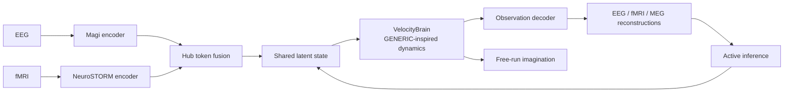

# Brain MoE-PINN: A Learned Generative Dynamical System for Multimodal Brain Data

**A technical introduction for computational neuroscience and bioinformatics researchers.**

Brain MoE-PINN is a species-conditioned model family spanning approximately 2.8M parameters for the current C. elegans profile to approximately 1.41B for the current human profile. It learns to *generate* brain dynamics from multimodal neuroimaging data — EEG, fMRI, and optionally MEG — while using physics-inspired inductive biases and diagnostics rather than claiming a thermodynamically valid model. Unlike a conventional encoder that maps brain data to a static embedding, this model learns a **velocity field** over a latent state space: given the current brain state, it predicts how the state will *evolve*. This lets it both *represent* brain activity (like a foundation model) and *simulate* its temporal evolution (like a biophysical model). The architecture sits at the intersection of representation learning and dynamical systems theory, targeting a regime — mesoscopic whole-brain dynamics — where neither purely biophysical simulation nor static representation learning is sufficient.

---

## 1. The Problem: Representation vs. Simulation

Two research traditions dominate computational brain modeling, and they rarely speak to each other.

**Brain simulation** solves differential equations for each neuron or neural population. Projects like The Virtual Brain (TVB) use connectome-based neural mass models at 200–1000 brain regions, supporting in-silico lesion experiments and inference via Dynamical Causal Modeling. At the extreme, spiking network simulations on supercomputers (Hygon Exascale, K Computer cerebellar models) integrate Hodgkin-Huxley equations for billions of neurons. These models are *generative* — you can run them forward without external input — but their parameters are hand-tuned or sampled from priors. They do not learn from data.

**Brain representation learning** trains encoders that map brain recordings to a latent space. BrainLM (2024) applies masked autoencoding to 6,700 hours of fMRI; NeuroSTORM (2026) scales this to 50,000+ subjects using a Shifted-Window Mamba backbone. For EEG, Magi provides a BERT-style encoder with 3D electrode embeddings. These models support decoding and transfer learning, but they do not *generate dynamics* — they produce a static embedding for each time window, with no notion of temporal evolution.

**Brain MoE-PINN bridges this gap.** It combines an encoder stack (representation learning) with a structured stochastic velocity field (simulation), enabling both encoding and generation in a single model. The velocity field uses GENERIC-inspired algebraic candidates—antisymmetry, nonnegative mobility, and pointwise degeneracy projections—as inductive biases. These do not by themselves establish a valid Poisson bracket, stochastic entropy production, or physiological energy/entropy interpretation.

---

## 2. Architecture Overview

The model processes EEG and fMRI simultaneously, with optional MEG — EEG (19–128 channels at 256 Hz), fMRI (400 brain regions at ~0.5 Hz), and MEG (306 channels at 256 Hz, `use_meg=True`) — through a pipeline with five stages:

```
EEG → Magi encoder ──────────┐
fMRI → NeuroSTORM encoder ───┼──→ Hub Token Fusion → z_global
MEG → BERT-medium encoder ───┘ (optional)                        │
                                                                    ▼
                                               Velocity Field (GENERIC + MoE)
                                                                    │
                                                                    ▼
                                               Decoder → EEĜ, fMRÎ, MEĜ (if enabled)
```

### 2.1 Encoders

**EEG — unified Magi backend.** `eeg_backend="v1"` retains the 8-layer,
512-dimensional BERT-medium-style path. `eeg_backend="v2"` selects the native
24-layer, 1024-dimensional Magi path with RoPE, GeGLU, pre-norm blocks,
alternating global/sliding-window attention, channel-type embeddings,
BIOT-style arbitrary electrode positions, variable channel counts capped by
`max_channels`, ECoG/sEEG amplitude normalization, and optional Mamba-2
context expansion. Both backends are selected through canonical
`BrainMoEPINN`/`ExperimentConfig`; there is no separate model class.

**fMRI — NeuroSTORM (frozen backbone).** A Shifted-Window Mamba backbone pretrained on 28.65 million frames from 50,000+ subjects. We freeze the backbone and train only a small adapter projection (~5M parameters). Task-specific Prompt Tuning (TPT) prepends learnable prompt vectors to the token sequence, enabling task-conditioned processing without modifying the backbone weights.

**MEG — Shared BERT-medium backbone (optional).** No pretrained MEG foundation model exists, so we share the EEG encoder's architecture and initialize from EEG weights via `load_from_eeg()`. This is justified by Maxwell's equations: EEG and MEG both arise from the same post-synaptic currents, differing only in measurement physics (volume conduction vs. magnetic induction). Sharing the backbone enforces this physical correspondence. MEG is disabled by default (`use_meg=False`); when enabled, the hub fusion expands from two to three tokens and the decoder gains a MEG reconstruction head.

### 2.2 Hub Token Fusion

Each encoder produces a sequence of token embeddings. Two learnable *hub tokens* — one per active modality (EEG and fMRI by default) — attend to these sequences via cross-attention, producing modality-aligned representations. A final fusion step produces a single global latent state $z_{\text{global}} \in \mathbb{R}^{1024}$ that integrates information from all available modalities. When MEG is enabled, a third hub token is added. The hub tokens are also preserved for downstream decoding.

### 2.3 The Velocity Field: Structured stochastic dynamics

This is the core of the model. Given a latent state $z$, we predict its velocity $\dot{z}$ — how fast and in which direction the state changes:

$$\dot{z} = \underbrace{L(z)\nabla E}_{\text{antisymmetric candidate}} + \underbrace{M(z)\nabla S}_{\text{nonnegative dissipative candidate}} + \underbrace{\mathbf{1}_{\mathrm{MoE}}\operatorname{MoE}(z)}_{\text{optional learned residual}}$$

**GENERIC-inspired inductive bias.** $E(z)$ and $S(z)$ are learned scalar fields, not physiological energy or entropy. $L(z)$ is constructed to be antisymmetric, while $M(z)$ supplies nonnegative diagonal mobility values learned from the state (a sigmoid gate calibrated so a fresh model reproduces the historical constant mobility). $\nabla E$ and $\nabla S$ are true autograd gradients of the potentials, scaled by learned positive factors — never unit-normalized, since a direction field that is not a gradient voids every degeneracy projection built on it. $L\nabla S$ is removed by a pointwise projector; the mobility is applied through an Öttinger projector $P_E M P_E$ with $P_E = I - \nabla E\nabla E^{\top}/\lVert\nabla E\rVert^{2}$, so the effective dissipative operator satisfies $M\nabla E = 0$ exactly instead of only being penalized toward zero. These properties are useful structural biases, but they do not establish the differential Jacobi identity, a globally valid GENERIC bracket, or stochastic thermodynamic entropy production.

The learned potentials are evaluated by their observable consequences—reconstruction, forecasting, free-run statistics, state transitions, and external behavioral alignment—not by assigning them physical units or physiological meaning.

**The MoE contribution** is an optional learned residual, not a universal species default. The C. elegans and zebrafish profiles disable it because their nervous systems are much smaller; mouse and human retain it for the higher-capacity end of the ladder. When enabled, eight *shared experts* — 2-layer residual MLPs at 1.0× width, ~2.1M parameters each at latent_dim=1024 — provide a dense backbone. Six *routed experts* (0.7× width, ~1.5M each) are selectively activated via a Top-3 gating mechanism, giving the model capacity to learn specialized dynamical modes. The measured default human MoE velocity block is ~26M parameters. An opt-in **deep-expert configuration** (`--use_deep_experts`) replaces the shared stack with 50-layer residual MLPs (52.5M each) and the routed stack with 14-layer MLPs (7.6M each), raising the parameter count sharply.

The router is a **recurrent selective state-space model** (a Mamba S6 core with 64-dimensional hidden state), not a stateless MLP. This is important: expert routing at time $t$ depends on the entire history of latent states $z_{<t}$, not just the current state. A stateful router produces smoother, more contextually appropriate expert allocation. The router's state is a registered PyTorch buffer, surviving device transfers and checkpoint save/load. A temperature parameter $\tau$ controls routing softness, annealed from 2.0 (near-uniform, encouraging exploration) to 0.7 (sharp, encouraging specialization) over the course of training.

**MoE scope: the structure claim holds for the backbone, not for the default experts.** With the default (`use_generic_moe=False`) experts add an unconstrained velocity *after* the degeneracy projections, so the *total* field is not GENERIC even though $L\nabla E + M\nabla S$ is. This is measured, not assumed: `moe_velocity_share` reports the experts' fraction of the applied velocity magnitude and `moe_energy_alignment` reports how strongly that unstructured part couples to $\nabla E$ (a random-init model sits near 0.76 and 0.16 respectively). Ablation predictions in §6 therefore test the *backbone's* contribution. Setting `use_generic_moe=True` makes each expert perturb $L$ and $M$ instead (`delta_L = UJU^\top`, `delta_M = diag(softplus) + VV^\top`, both projected), so the composite field keeps the structure; `configs/species/mouse.json` already enables it. Historically that mode cost 14.4× the plain experts (379M vs 26M parameters at latent_dim=1024); a bottleneck on the low-rank factor maps brought it to 3.7× (96M), which is why it is now a practical option rather than an ablation curiosity.

The low-rank factorization $L(z) = U(z) J U(z)^\top$ reduces parameter count and supplies an antisymmetric geometric bias. Because $U$ is state-dependent, it does not guarantee the Jacobi identity; the optional Jacobi diagnostic requires a differentiable operator and explicit state points and is not enabled for the 1024-dimensional training path. The operator is applied **implicitly**: only $L v = U(J(U^\top v))$ is ever computed ($O(d\,r)$), because the degeneracy projector commutes with the action, $(P_S L P_S)\nabla E = P_S L (P_S \nabla E)$. Materialising $L$ and forming $P L P$ costs two $d\times d$ matmuls per sample and produced bit-identical velocities; `materialize_poisson=True` restores it for diagnostics that need the matrix.

### 2.4 Multi-Time-Scale Dynamics

The velocity field operates at multiple timescales through three mechanisms:

**Multi-Time-Scale KDA (MT-KDA)** — not to be confused with the decoder's Kimi Delta Attention — maintains three parallel exponential moving averages of the velocity with per-step decay rates $\alpha = 0.1, 0.5, 0.9$. When `latent_dt` is supplied these are converted to physical time constants $\tau = -1/\ln\alpha$, i.e. roughly 0.43 s, 1.4 s and 9.5 s at the default alphas. They are latent-state filters spanning a fast/medium/slow decomposition; they are *not* synaptic (~10 ms), working-memory (~100 ms), or hemodynamic (~1 s) time constants, and no biophysical process is being identified. A learned gating network combines the three branches, and the running states are registered as buffers (not optimizer parameters) to avoid polluting the optimizer with mutable state.

**Slow Manifold Projector** extracts sub-0.25 Hz ultra-slow dynamics via a learned 256×1024 projection. This is where cross-modal alignment between EEG and fMRI lives — the fast electrical signals and slow hemodynamic signals meet on this manifold through a physics-structured Latent HRF Bridge.

**OU-Structured Noise and the SDE policy.** Colored (Ornstein-Uhlenbeck) noise is applied according to an explicit `noise_mode` policy — `off | rollout | train | always` (default `off`: deterministic latent steps). The OU state uses the exact discrete recursion $a = e^{-\Delta t/\tau}$ with unit stationary variance, and the noise enters the velocity as $\sqrt{2 D_{eff}/\Delta t}\,\eta$, so the integrated latent increment has the Euler–Maruyama magnitude $\sqrt{2 D_{eff}\Delta t}$ — noise scales with $\sqrt{\Delta t}$, not $\Delta t$. The integrator and the noise share one clock (`integration_dt`, derived from `latent_dt`) by construction. When enabled, the Wiener Homeostat scales $D_{eff}$ for the active mode (tensor-native EMA, periodic update, optional per-component calibration via `calibrate_dim_gain`).

**Stimulus and intervention control conditioning.** Loaders may declare control-role modalities (stimulus tracks: salt steps, drifting gratings, temperature gradients, task events); the trainer reduces the windowed control to a per-step perturbation — `(B, K, U)` with `K = rollout_steps` segment means (the default `control_reduction="resample"`), so stimulus timing survives into the latent steps. `control_reduction="mean"` collapses the whole window to a single vector and is only appropriate for stationary controls; `control_reduction="peak"` preserves sparse optogenetic pulse amplitudes. For single-neuron optogenetics, `opto` is encoded as `[waveform, waveform * target_one_hot]` from a fixed species-specific target vocabulary, so light-off gives an exact zero control and target identity cannot act without the intervention. Its contribution to `perturbation_dim` is waveform width plus target-vocabulary width; the total width also includes every other active control modality. `VelocityBrain` then (a) adds a bias-free, zero-initialized control readout (so $u = 0$ is an exact no-op in any trained state) and (b) applies zero-initialized input-conditioned gates — identity at init — that modulate the mobility and arousal terms, letting stimuli reshape dynamics rather than merely offset velocity.

### 2.5 Decoders

The decoder uses **KDA (Kimi Delta Attention)**, a linear-complexity attention mechanism from Kimi (arXiv:2510.26692). Unlike standard softmax attention, KDA uses a delta rule — the attention output is computed as an incremental update to a recurrent hidden state, with per-key-dimension gating for selective state-tracking. This makes it ideal for autoregressive generation: each new token updates the state in $O(d)$ rather than $O(n^2)$. In our architecture, KDA layers are interleaved with standard linear layers in a 1:3 ratio (25% KDA, 75% linear), following the Kimi Linear hybrid design. On CPU, the FLA library's `causal_conv1d` component requires CUDA, so a fallback decoder (`ModalityDecoderRouter`) is available for CPU-only development.

The decoder gate concatenates hub tokens from all active modalities. For a model with EEG + fMRI + MEG enabled, this produces a 3072-dimensional gate input (3 × 1024), enabling cross-modal information to influence reconstruction of each modality.

EEG and fMRI are always reconstructed; MEG is reconstructed only when enabled. The MEG reconstruction loss closes a gradient gap that would otherwise leave the MEG decoder supervised only through the cross-modal hub fusion path.

### 2.6 Active Inference and Imagination

The model operates in two modes:

**Perception mode** processes real sensor data through the encoders. After predicting $z_{t+1}$ via the velocity field, an active inference loop compares the decoder's reconstruction $\hat{x}_{t+1}$ against the actual observation $x_{t+1}$ and corrects the latent state using the prediction error. A GRU-based delay predictor consumes a history of latent states (detached, FP32) to produce the delay-compensated state — a learned predictor in the spirit of a Smith Predictor rather than the classical delay-free-model construction — and a Precision Gate weights corrections by delay and action magnitude (its mapping is learned, not the closed-form exponential).

**Imagination mode** runs the model forward without external input — the velocity field drives the dynamics autonomously. A Counterfactual Tree Search (depth 3, branch factor 4) explores possible futures; a learned trajectory discriminator scores each candidate path and a soft minimum selects one, after which a free-energy-like scalar (`compute_efe`: the negative of the learned value function, plus goal distance and an explicit control cost) is reported to the action loss. **The tree search does not itself optimize EFE**, and that scalar is *not* the variational Expected Free Energy — there is no observation model, no posterior over hidden causes, and no epistemic term. Rollouts run the base velocity backbone only: MoE modulation, stimulus control, species conditioning, and the multi-time-scale filter are not part of the search. The selected trajectory's endpoint then biases the velocity field, creating a closed action-perception loop.

During training, imagination runs on designated steps (controlled by an `imagination_interval` curriculum) to manage computational cost. Imagination components are gated behind a `use_imagination` flag — when disabled, they consume no memory.

### 2.7 Memory Systems

**Hebbian Associative Memory** stores latent states via Oja's rule — a biologically plausible Hebbian update that maintains normalized weights ($W^\top W \approx I$). The engram trace provides a long-term reference for replay loss, comparing imagined states against stored memories. Hebbian weights are spectrally normalized every 100 steps to prevent runaway growth.

A **replay buffer** accumulates imagined states (capacity 256) and provides temporal pairs for replay loss computation. The buffer is cleared alongside other state when `reset_history()` is called at phase boundaries.

### 2.8 Magi v2, ECoG, and cross-modal integration

Magi v2 is a native observation backend, not a second Brain MoE-PINN model.
The implementation is split across the vendored `magi/` package and
`encoders/eeg_encoder_v2.py`:

- The Magi backbone scales to the ModernBERT-large design target
  (24 layers × 1024 hidden dimensions), with RoPE, GeGLU, pre-norm blocks,
  alternating global/sliding-window attention, and tiling initialization from
  the v1 depth.
- Channel-type embeddings distinguish scalp EEG, ECoG grid, sEEG depth, and
  unknown channels. BIOT-style position features support arbitrary electrode
  layouts, while `max_channels` bounds memory use.
- The foundation wrapper also exposes momentum-encoder, masked-prediction,
  contrastive-projection, and adversarial-subject-classifier components for
  standalone Magi pretraining; the canonical BrainMoEPINN forward path uses
  the projected encoder representation.
- ECoG/sEEG amplitudes are normalized before encoding (`1/20` for ECoG grid
  and `1/10` for sEEG depth by default).
- Optional Mamba-2 context expansion and pretrained checkpoint loading are
  propagated through the canonical model lifecycle methods.
  `data/ecog_dataset.py` handles DANDI NWB, EDF, and BIDS inputs, including
  variable channel counts, MNI coordinates, and paired ECoG-fMRI windows.
  `data/ecog_preprocessing.py` provides resampling, filtering, rereferencing,
  z-scoring, bad-channel detection, and coordinate extraction.
- `data_loader.EEGDenoiseNetDataset` consumes the public
  [EEGdenoiseNet](https://github.com/ncclabsustech/EEGdenoiseNet) epoch
  files from either the checkout root or its `data/` directory. It accepts
  the published NumPy/MAT formats, keeps deterministic train/validation/test
  splits, and synthesizes the benchmark's clean-plus-EOG/EMG views using its
  RMS/SNR convention. The release has 4,514 clean 2-s epochs, 3,400 ocular
  artifact epochs, and 5,598 muscular artifact epochs; EOG is 256 Hz and EMG
  is 512 Hz, with clean EEG resampled for the EMG path. The primary clean
  epoch is used for Magi masked/causal pretraining and the matched
  artifact-contaminated epoch is the contrastive view; source arrays must be
  materialized rather than annex pointer files.
- `configs/data/eegdenoisenet.json` is the ready-to-use Phase -1 profile
  (`--phase -1 --eeg_backend v2 --eeg_channels 1 --data
  configs/data/eegdenoisenet.json`); this EEG-only path does not fabricate
  fMRI targets.

- Human EEG/MEG/fMRI ingestion is manifest-first and local-only.  The
  `data/ingest_human.py bids-session` command discovers BIDS EEG/MEG files,
  reads EDF/BDF/FIF/BrainVision/EEGLAB/CTF recordings through lazy MNE
  adapters, extracts atlas-parcel or bounded voxel time series from BOLD
  NIfTI, and writes the canonical `(C, T)` ladder plus channel IDs, masks,
  per-modality rates, and provenance.  Existing fMRIPrep or SPM NIfTI
  derivatives are valid inputs; neither acquisition nor spatial
  preprocessing is hidden in the command.  Example:

  ```bash
  python -m brain_moe_pinn.data.ingest_human bids-session \
    --bids-root /data/openneuro/ds006040 --subject 01 \
    --task rest --modalities eeg fmri --eeg-rate 256 \
    --atlas /data/atlas.nii.gz --origin OpenNeuro:ds006040 \
    --out /data/data_ladder/human_bids
  ```

  Heterogeneous records use `data/corpus_pipeline.py` source manifests:
  `format: mne` for EEG/MEG and `format: nifti` for fMRI.  Relative paths are
  resolved against the manifest, no dataset is downloaded implicitly, and
  `SpeciesSignalDataset` selects physical-second windows at training time.
  Different EEG/MEG/fMRI clocks remain separate in
  `<modality>_rate_hz`; `cross_modal_label` must be explicitly set to `1`
  only for verified synchronization and to `0` for an intentional async pair.
  Install the optional readers only for the formats used (`mne-python` for
  electrical recordings and `nibabel` for NIfTI).  TorchEEG remains optional
  for dataset-specific EEG transforms; the canonical adapter does not require
  it because the same profile also handles MEG and fMRI.

The canonical construction path is:

```python
from brain_moe_pinn import BrainMoEPINN

model = BrainMoEPINN(eeg_backend="v2", use_channel_type_embed=True)
```

`configs/species/*.json` and `configs/ladder.json` define the species/data
contract. `train.py` is the only training entrypoint and accepts
either a JSON profile or explicit model flags. The Magi backend, ECoG data
path, MoE routing, context expansion, and multi-step rollout therefore share
one model/configuration surface.

---

## 3. The Loss Function: Physics Through Supervision

`LossWeights` (in `training/training_phases.py`) separates **steering terms** —
weights $> 0$, applied with stage-dependent weights — from monitor/dormant
terms kept at weight 0.  Positive weights are executable only when their data
contract is present; missing future, pairing, policy, or intervention targets
raise instead of silently skipping supervision.

$$\mathcal{L}_{\text{total}} = \sum_{\ell \in \text{steering}} w_\ell \cdot \tilde{\mathcal{L}}_\ell$$

Where $\tilde{\mathcal{L}}_\ell$ is an EMA-normalized version of each steering
loss (mean/std calibrated over warmup and frozen thereafter).  Dense stages
steer EEG/fMRI reconstruction, dissipation, MoE load balancing, grassmannian
regularization, spectral slope, band power, and SIGReg.  P3-P6 additionally
declare two-horizon forecast supervision.  Stage 2 steers labelled cross-modal
and HRF alignment; Stage 3 leaves action, replay, and intervention-response
terms disabled until their explicit contracts are supplied.

**Reconstruction losses** (EEG, fMRI, MEG): Standard MSE between decoder output and input signal. These are the primary training signal — all other losses are auxiliary.

**Structured-dynamics losses:**
- *Degeneracy constraint*: pointwise residuals in $L\nabla S$ and $M\nabla E$. These are **enforced by projection, not by penalty**, so the residual is identically zero and `generic_constraint` carries weight 0 in every phase: $(P_S L P_S)\nabla S = P_S L (P_S \nabla S) = 0$ because $P_S \nabla S = 0$, and likewise $(P_E \mathrm{diag}(M) P_E)\nabla E = 0$. The weight only becomes live if `apply_degeneracy_projection` is disabled. It remains a local algebraic statement, not a proof of global GENERIC validity or of the Jacobi identity.
- *Jacobi diagnostic*: requires derivatives of a callable Poisson map and explicit state points. It raises an error when those inputs are absent rather than reporting a false score; it remains disabled for the high-dimensional training path.
- *Grassmannian regularization*: encourages expert attractor subspaces to be orthogonal, preventing expert collapse.

**Auxiliary losses:**
- *NSP (Neurodynamics Statistics Prediction)*: Predicts band powers and
  functional connectivity from latent representations, inspired by the
  DeeperBrain model.  Monitor/dormant at weight 0: the current implementation
  only matches band powers between reconstruction and target, duplicating the
  band-power loss; re-enable after implementing the latent-to-statistics head.
- *Cross-modal alignment*: Cosine similarity between active hub tokens
  (EEG/fMRI by default; MEG included when enabled).  Every row carries an
  explicit `cross_modal_labels` value: 1 for synchronized pairs and 0 for
  intentionally asynchronous pairs.  The HRF bridge uses the same labels and
  excludes asynchronous rows; missing labels fail closed.
- *Velocity smoothness*: Temporal TV over emitted rollout
  `delta_z_sequence`; it is dormant unless a phase enables it.
- *MoE load balancing*: Encourages uniform utilization across routed experts,
  preventing a single expert from dominating.
- *Hebbian regularization*: Dormant at weight 0; Oja's rule already keeps
  $W^\top W \approx I$, and its input is detached `.data` (no gradient).  The
  weight norm is logged as a monitor; spectral control happens through the
  periodic normalization pass in the training loop.
- *Latent concentration (tsallis)*: Dormant at weight 0; SIGReg is the chosen
  anti-collapse term.
- *Action loss*: Matches predicted EFE to an explicit executed-action utility
  target; it is not enabled by default because a self-generated EFE is not a
  supervised action outcome.
- *Replay loss*: Matches imagined states to an explicit replay target.  It
  does not use the model's engram output as its own target.
- *Intervention response*: Runs matched treated and baseline perturbations and
  fits their predicted latent effect to an explicit `intervention_target`;
  missing perturbation/effect contracts raise.


---

## 4. Training Strategy

### 4.1 Phased Curriculum

Training has two distinct representations: executable phase configurations
and older token-ledger hypotheses. The executable CLI schedule is:

| CLI phase | Loop steps | Configured batch | Nominal batch visits* | Role |
|---|---:|---:|---:|---|
| **Phase -1** | 10,000 | 32 | 0.32M | Executable Magi v2 masked/causal/contrastive EEG pretraining |
| **Stage 1 (P1–P6)** | 235,000 | 16 | 3.76M | Reconstruction, two-horizon forecast where declared, routing, and physics-inspired diagnostics |
| **Stage 2** | 20,000 | 16 | 0.32M | Labelled cross-modal latent and HRF bridge |
| **Stage 3** | 50,000 | 16 | 0.80M | Hebbian memory and online-assimilation hooks; policy losses are opt-in |
| **Total** | **315,000** | — | **5.20M** | Current executable phase schedule |

`*` Nominal batch visits are `loop steps × configured phase batch`; they are
not token counts. DeepSpeed gradient accumulation, sampler reuse, and dataset
windowing determine the effective global-sample count.

Stage 2 expands its model context from 4,096 to 8,192 to 16,384. Stage 3
expands from 16,384 to 32,768 to 65,536. These schedules update model-side
context buffers; they do **not** automatically change the `seq_seconds`
windows constructed by the data loader. A valid long-context budget therefore
requires an explicit data-window contract and a measured batch trace.

The previous 67B/364B token plans and the 74-day estimate are retained only as
historical arithmetic comparisons in §4.4. They are not validated execution
targets.

### 4.2 Why MoE From the Start (No Dense Pretraining)

MoE-from-start remains an architectural hypothesis, not a measured scaling
result. The current configuration starts with shared and routed experts to
avoid a dense-to-MoE conversion, but the earlier 16B/140B token comparison
has not been established by convergence or throughput measurements. Treat
expert specialization, active-parameter counts, and data requirements as
validation questions on held-out corpora.

### 4.3 Hardware and Distributed Training

- **Local development:** CPU-only development is supported for tests, manifest inspection, and preprocessing. No local GPU throughput is assumed.
- **16 GiB cards:** candidate tier for C. elegans, zebrafish, and mouse short-window runs with microbatch 1; peak memory must be measured on the target topology.
- **24 GiB cards:** animal-profile pilot tier and human short-context ZeRO-3 smoke tests across multiple cards.
- **32 GiB cards:** human short-context calibration tier; do not infer 16k or 65k feasibility without a real batch trace.
- **48–80 GiB cards:** candidate tier for human medium/long-context experiments; 65,536-context training remains unclaimed until activation and communication peaks are measured.
- **DeepSpeed ZeRO-2/3:** use the checked-in configs as starting points, with activation partitioning enabled and CPU checkpointing/offload disabled by default.
- **Mixed precision:** FP16 autocast is configured with selective FP32-sensitive operations. The configuration keeps FP32 master weights, so parameter-only memory estimates must not be treated as FP16-weight estimates.
- **Device-agnostic runtime:** all device references are centralized in `runtime/device_utils.py`; there is no hardcoded `.cuda()` path outside that module.

### 4.4 Compute budget: measured parameters, not a token target

The 67B and 364B token ledgers are historical planning hypotheses. Current parameter counts from the active species configurations are:

| Profile | Parameters | FP16 export | Static training-state lower bound |
|---|---:|---:|---:|
| C. elegans | 2.81M | 0.005 GiB | 0.042 GiB |
| Zebrafish | 14.78M | 0.028 GiB | 0.220 GiB |
| Mouse | 60.33M | 0.112 GiB | 0.899 GiB |
| Human core | ~1.411B | ~2.63 GiB | ~21.03 GiB |

The static lower bound uses approximately 16 bytes per parameter for FP16 model weights, FP32 master weights, gradients, and Adam states. It excludes activations, second-order physics graphs, temporary tensors, communication buckets, allocator fragmentation, and checkpoint duplication. Because the checked-in configuration keeps FP32 master weights and may retain FP32-sensitive live tensors, the actual static term can be closer to 20 bytes per parameter before those overheads.

For an order-of-magnitude parameter-only comparison:

$$
F_{\mathrm{lower}} \approx 6PN
$$

where $P$ is the parameter count and $N$ is the number of sequence positions. The current human core therefore contributes approximately 8.466 GFLOP per position before model-specific overhead.

| Position ledger | Parameter-only lower bound | Time at 1 effective PFLOP/s | Status |
|---|---:|---:|---|
| Historical 67B ledger | 0.567 ZFLOP | 6.57 days | Arithmetic comparison only |
| Historical 364B ledger | 3.082 ZFLOP | 35.67 days | Arithmetic comparison only |
| Historical 74-day claim | 7.417 ZFLOP | 85.84 days | Not reproduced; not a budget |

The old 64×V100 assumption (`125 TFLOP/s × 14.5% effective MFU`) corresponds to approximately 1.16 effective PFLOP/s. At that rate, the 364B lower bound is approximately 30.75 days, so the 74-day claim contains an unmeasured approximately 2.41× overhead factor. Replace all such estimates with measured `FLOP/update × updates` after a representative cluster calibration.

### 4.5 Data, storage, and controlled-intervention plan

The first intervention ladder uses processed traces and explicit event metadata rather than raw imaging movies:

| Corpus | Current measured source size | Intervention scope | Status |
|---|---:|---|---|
| Local C. elegans salt pilot | 0.197 GiB | Salt stimulus; not optogenetic | Ingested and verified |
| Randi C. elegans PumpProbe, [OSF e2syt](https://api.osf.io/v2/nodes/e2syt/files/osfstorage/) | 1.2 GiB local export, 113 recordings | Recording-local neuron-targeted optogenetic stimulation; source target IDs, labels, and event files are preserved | Canonical ladder ingested and model-smoke verified |
| HuggingFace `celegans_neural_data` | 669.5 MB parquet; 919 emitted worms | Calcium-only activity; source has no unified intervention track | Downloaded and ingested into the canonical ladder |
| Unified C. elegans manifest root | Small manifest; references the three canonical roots | One `stimulus` control contract, source-local calcium identities | 1,056 rows assembled; remote training pending |
| [DANDI:001569](https://dandiarchive.org/dandiset/001569/draft) | 2.833 GiB, 13 NWB assets | Targeted two-photon photostimulation of rsChRmine-expressing neurons | Inspect one asset before full download |
| [OpenNeuro ds001541](https://openneuro.org/datasets/ds001541/versions/1.1.3) | 6.947 GiB, 597 snapshot files | DRN population optogenetic fMRI | Use population/region scope, not neuron one-hot |
| Velez-Angel et al. zebrafish lateral-line study | No public archive identified | Single-neuromast stimulation plus whole-brain calcium imaging | Contact-gated; not included in the storage budget |

The checked-in Randi adapter consumes the local text export without a hidden
download:

```bash
python -m brain_moe_pinn.data.ingest_randi \
  --input ../exported_data \
  --output ../data_ladder/c_elegans_randi
```

Use `configs/species/c_elegans_randi.json` with
`configs/data/c_elegans_randi.json` for the 2 Hz, 15-second-window,
recording-local target-position experiment. The adapter follows the supplied
TSMixer-Ext pulse levels, uses the measured 0.5-second clock rather than the
gist's 0.05-second plotting value, masks invalid fluorescence frames instead
of deleting target channels, and preserves the original labels under
`randi_labels/`. It does **not** import gKDR-GMM metadata; that metadata remains
owned by the separate Toyoshima salt adapter.

The unified C. elegans profile is
`configs/species/c_elegans_unified.json` plus
`configs/data/c_elegans_unified.json`. It keeps source-qualified subjects and
recording-local channel ids, uses batch size 1 with 15-second physical windows,
and presents `stimulus` at perturbation width 282: feature 0 is the salt or
opto drive, features 1–281 are Randi recording-local target gates, and
HuggingFace rows omit control. The manifest-federated root avoids another
multi-hundred-MB copy; package the three source roots together or run the
merge command with `--materialize` for a self-contained remote bundle.

The four locally measurable sources above total approximately **10.835 GiB raw**. A conservative `raw + conversion + canonical cache` factor of 3 gives approximately **32.5 GiB** for a sequential working set; use **at least 100 GiB of cluster scratch** for the three-species pilot, including logs and checkpoints. A 25 GiB local volume is not sufficient to stage all sources safely. Collections above 100 GiB should be streamed or staged on **at least 500 GiB** of scratch/object storage.


### 4.6 VRAM feasibility and execution gates

For the current human parameter count, static ZeRO estimates are:

| Data-parallel world | ZeRO-2 static estimate/GPU | ZeRO-3 static estimate/GPU |
|---:|---:|---:|
| 4 cards | 9.20 GiB | 5.26 GiB |
| 8 cards | 7.23 GiB | 2.63 GiB |
| 16 cards | 6.24 GiB | 1.31 GiB |

These values omit activation and communication peaks. A human run is considered cluster-ready only after a 1,000-update calibration records peak allocated/reserved VRAM, updates/s, measured FLOP/update, communication wait, and held-out-subject intervention metrics. The resulting budget is:

$$
\text{GPU-days} =
\frac{11.574 \times F_{\mathrm{ZFLOP}}}
{T_{\mathrm{effective,PF/s}}}
$$

No VRAM tier currently carries an unconditional 65,536-context guarantee.

### 4.6.1 Unified C. elegans capacity checkpoint

The unified profile was measured with
`configs/species/c_elegans_unified.json` (latent dimension 192,
perturbation width 282, generic observation adapter, no MoE):

| Measurement | Result |
|---|---:|
| Total model parameters | 2,860,753 |
| Dynamics parameters | 1,661,258 |
| FP32 parameter storage | 10.913 MiB |
| Largest tested calcium window | 281 channels × 30 frames (Randi, 15 s) |
| Peak incremental CPU RSS after model construction | 39.469 MiB |

The CPU benchmark completed finite forward/backward passes for the largest
Toyoshima, Randi, and HuggingFace channel-count rows. The current host
inventory reports an 8 GiB unified CPU/GPU memory limit and one Apple A18 Pro
integrated Metal candidate; PyTorch reports MPS available, but no dedicated
VRAM amount exists and the full benchmark below was run on CPU. The
parameter/activation measurement supports a **4 GiB dedicated-GPU planning
floor** for this exact batch-1 profile, with **8 GiB recommended** for
allocator, checkpoint, and runtime headroom; 12–16 GiB is the comfortable tier
if windows, workers, or future model features grow. These are planning tiers,
not a claim about a remote provider's SKU. A remote run still needs a short
calibration for peak allocated/reserved VRAM and throughput before scaling.

Remote training is **pending and intentionally not launched**. The current
For biological free-run evaluation, use the neighboring `../TDE-RICA` toolbox
as an independent reference rather than treating reconstruction loss as a
generator score. The local adapter is `tools/tderica_free_run.py`; it reports
the native correlation/variance/autocorrelation suite plus TDE-RICA time
alignment, distribution, and optional D3 continuous-dynamics metrics. The
physical clock is mandatory:

```bash
python tools/tderica_free_run.py \
  --real real_window.npy \
  --generated generated_window.npy \
  --dt-s 0.333 \
  --tderica ../TDE-RICA \
  --no-d3 \
  --output tderica_report.json
```

For the remote GPU run, first generate deterministic, unforced model output
from the best checkpoint, save `(T,N)` real/generated windows, and run the
same evaluator in a clean process. Use `--full-d3` only after the fast report
is finite; TDE-RICA's transfer-entropy and local-Jacobian estimators are
high-dimensional diagnostics, not training objectives.
manifest-federated root must be transferred with all three canonical source
roots, or materialized with `data/merge_c_elegans.py --materialize`.

The cross-modal inventory is organized around:

- ECoG/iEEG: AJILE12 (`DANDI:000055`), synchronized iEEG-fMRI
  (`DANDI:000623`), scalp+iEEG (`DANDI:000574`), and PtNRGrids
  (`DANDI:000465/000554`).
- fMRI: UK Biobank, HCP, ABCD, and HBCD, with HBCD treated as separate
  protocols rather than simultaneous EEG-fMRI recordings.
- Low-resolution EEG: TUH EEG, LEMON, and MPI-Leipzig.

Dataset sizes and token/position counts remain acquisition estimates until the corresponding files are downloaded, standardized, and measured locally or on cluster scratch.

---

## 5. Stability and Monitoring

Training this model family — from 2.8M/14.8M/60.3M animal profiles to the approximately 1.41B human profile — with a multi-term steering loss stack, monitored auxiliary terms, second-order physics graphs, and physical constraints requires layered defenses:

**Seven-layer stability defense:**
1. KDA state L1 normalization every 64 steps
2. Pointwise degeneracy projection every step
3. Kahan summation for floating-point accumulation
4. Stable softmax (subtract max before exp)
5. Hebbian spectral normalization every 100 steps
6. EMA monitoring of observable control proxies and router entropy
7. Energy audit: track total energy-like field output for divergence

**AutoRollback** (`training/stability.py`) uses explicitly named diagnostics: (1) negative signed-work ratio when a trajectory diagnostic is supplied; (2) energy-like divergence; and (3) router entropy collapse. The first trigger is not an entropy-production estimate. A fourth trigger keyed on a `ks_entropy` metric was removed: nothing ever emitted that key, so it could not fire.

**Wiener monitors** run at a fixed cadence (default: every 10 training steps, `monitor_interval` on BrainMoETrainer) and only in training mode, so evaluation stays history-independent. They regulate stochastic noise only when explicitly enabled; their setpoints are control targets, not universal criticality observables.

### 5.1 Key Fixes for Training Stability

During development, several stability-critical issues were identified and resolved:

**State management.** Two components stored mutable running state as plain Python attributes or `nn.Parameter` tensors — patterns that fail under `.to(device)`, `state_dict()`, or distributed training. The **PoissonSSMRouter's recurrent SSM state** (which accumulates temporal context for expert routing) and the **MultiTimeScaleKDA's three timescale states** (which maintain fast/medium/slow velocity averages) were both converted to registered PyTorch buffers with in-place `.data` updates. This ensures they survive device transfers, appear in checkpoints, and are properly synchronized across distributed workers.

**Imagination timing.** The joint perception-imagination forward pass (which closes the action-perception loop by running CFTS and EFE computation inside perception mode) was accidentally duplicated — the code block appeared twice, causing CFTS to run twice per step. The duplicate was removed, leaving a single coherent path. Additionally, the `_imagination_active` flag that controls whether imagination runs on a given step was being set *after* the forward call, creating a one-step lag and incorrectly activating imagination on step 0. It now executes before the forward pass, ensuring the flag reflects the current step.

**Dimension hygiene.** The `action` tensor passed to the active inference loop was hardcoded at 2048 dimensions while the latent space is 1024-dimensional. This was fixed to match. In the Poisson router, the standard Mamba S6 discretization $B\Delta = \Delta \cdot B_{\text{proj}}(z)$ was incorrectly written as $B_{\text{proj}}(z) \cdot \Delta.\text{unsqueeze}(-1)$, causing a broadcast failure when batch and state dimensions collided.

---

## 6. Validation and Testable Predictions

The model makes specific, falsifiable predictions that can be tested through ablation experiments:

| Component | Prediction | Test |
|-----------|-----------|------|
| Degeneracy projection | Disabling $L\nabla S = 0$ or $M\nabla E = 0$ causes trajectory instability | Delta-z Frobenius norm growth > 2× |
| Grassmannian regularization | Without it, expert subspaces collapse (become non-orthogonal) | Off-diagonal Gram norm increases |
| Poisson conservative term | Without it, EEG PSD flattens (loses oscillations) | 1/f slope drops below 0.5 (healthy: 0.8–1.2) |
| SSM router vs. MLP router | Recurrent routing reduces expert switching frequency | Switching frequency < 0.5× MLP baseline |
| Band-power + spectral slope loss | Models without these fail to reproduce correct spectral profiles | Per-band MSE; alpha suppression ratio |

**Baseline comparisons** against four simplified architectures (VAE+Neural ODE, Graph Neural ODE, No-hub-token fusion, Transformer trajectory model) on five metrics (reconstruction MSE, PSD slope fit, FC correlation, parameter count, throughput) determine whether each complex component provides net benefit.

---

## 7. Design Principles

Several design choices distinguish this project from conventional deep learning architectures:

**Forward-increment parameterization.** The model predicts a latent increment $\Delta z$ rather than directly emitting $z_{t+1}$. This is an architectural choice that supports causal forecasting; it does not prove microscopic irreversibility, prevent time-reversal analysis, or establish a nonequilibrium steady state.

**Physics-inspired structure, not a theorem.** The forward pass combines antisymmetric and dissipative candidate terms, pointwise degeneracy projections, and stochastic-noise modules. Loss terms and diagnostics reinforce these inductive biases, but they do not establish a valid GENERIC or metriplectic system without separate bracket, stochastic-process, and empirical validation.

**Emergence paradigm.** In Stage 1 P1, all physics losses have zero weight. The model is expected to self-organize through reconstruction pressure and MoE routing competition — complex dynamics should emerge from simple objectives. Physics losses are gradually activated from P2 onward, acting as guardrails rather than hand-holding.

**State is explicit, not hidden.** All temporal state in the model — the router's SSM state, the KDA timescale states, the Hebbian weight matrix, the replay buffer — is registered as named PyTorch buffers. Nothing is stored as a plain Python attribute that would be lost on `.to(device)` or checkpoint save. This is a deliberate engineering choice, not just a fix: in a model where temporal continuity is essential, losing state is losing the computation.

---

## 8. Current Status and Limitations

**What works (verified by smoke tests on CPU; re-verified in the 2026-09 checkout):**
- Full forward and backward pass — parameter totals are configuration-dependent. The `magi` encoder is vendored in-repo but needs the `transformers` package (absent from the local dev venv), so end-to-end totals could not be re-measured locally (2026-09); re-measure at first cluster launch. Measured in this checkout: MoE velocity block = 25.6M (default shallow experts) / 466.1M (`--use_deep_experts`). Older 770M/147M smoke-test totals came from a pre-revision architecture and are not valid resource estimates.
- All steering loss terms compute correctly, including the spectral slope loss on reconstructed EEG/MEG; dormant terms are exercised in monitoring/ablation mode (2026-09)
- Gradient flow verified across all components (encoder stack, velocity field, MoE, decoder)
- Router state persists correctly across forward calls and resets
- Multi-Time-Scale KDA states update correctly as buffers
- Spectral slope guard correctly returns zero loss for sequences with fewer than 16 temporal samples

**Known limitations:**
- The KDA decoder uses `causal_conv1d` from the Flash Linear Attention (FLA) library, which requires CUDA. A fallback decoder is available for CPU development.
- The training loop currently passes `actual_eeg` as a slice of the *input* EEG, not data from time $t+1$. True online active inference requires a paired-sequence dataloader.
- Pretrained NeuroSTORM and BrainLM weights need to be downloaded (loading infrastructure is in place).
- Velocity smoothness sits at weight 0 until sequence-level training (multi-timestep batches) emits `delta_z_sequence`; it now takes true temporal TV and returns zero for single-step input. The misnamed `ks` / velocity-difference regularizer was deleted (it was 0.0 in every phase and duplicated this term).
- The 1/f constraint now lives in exactly one place (SpectralSlopeLoss); BandPowerLoss's built-in estimator is gated behind `include_one_over_f=True` for standalone ablation only.

### Controlled dynamics and causal validation

`VelocityBrain` and the canonical `BrainMoEPINN` model accept an optional
`perturbation`/control tensor when constructed with `perturbation_dim`. This
adds an explicit learned control term to the latent velocity. The interface
supports intervention-response experiments, but conditioning on a perturbation
does not itself identify causality; valid intervention timing, controls,
randomization or another identification strategy, and subject-held-out
evaluation are still required.

`diagnostics/causal_dynamics.py` provides controlled rollouts,
treated-versus-baseline response metrics, and forward/reverse prediction gaps.
These are operational temporal-asymmetry diagnostics, not thermodynamic
irreversibility proofs.

`physics.stochastic_process` defines the controlled-SDE contract, Euler-Maruyama
steps, Gaussian transition likelihoods, and conditional forward/reverse path
log ratios. A total path entropy-production value is returned only when the
caller supplies both boundary log densities and a correctly specified reverse
process, including parity handling for odd variables.

Jarzynski/Hatano-Sasa protocol estimators and stronger global Poisson/GENERIC
construction are intentionally deferred until controlled datasets and
physically anchored state/process definitions are available.

### Unified model and cross-species data ladder

There is one canonical implementation: `BrainMoEPINN` in `__init__.py`.
Magi v2, ECoG/sEEG channel metadata, and multi-step rollout are native
capabilities of that model; there is no separate v2 model or compatibility
entrypoint.

Species profiles live in `configs/species/*.json`, with the ordered replay
contract in `configs/ladder.json`. Each profile specifies modalities, sampling
units, channel/region bounds, feature gates, and leave-subject-out training
metadata. Species conditioning is metadata conditioning only; it is not a
claim that channels or regions are anatomically homologous across species.

For calcium, voltage, widefield, behavior, and other variable-channel inputs,
call `BrainMoEPINN.forward_modalities` with a mapping of modality names to
`(B, channels, time)` tensors. This path runs the shared latent dynamics with
explicit multi-step rollout. It does not fabricate EEG/fMRI reconstruction
targets for species that lack them; instead, with `reconstruct=True`, any
modality within `recon_max_channels` is encoded channel-wise
(`ChannelSignalAdapter`) and decoded back to its raw sampling grid
(`SignalReconstructionHead`, which generates the waveform from the evolved latent), emitting
`{modality}_recon` keys. Supervise those with `LossWeights.recon_extra`
(e.g. `{"calcium": 1.0}`), which `TotalLoss` applies through the same generic
reconstruction registry as `recon_eeg`/`recon_fmri`/`recon_meg`. Human
EEG/fMRI/MEG reconstruction remains available through the standard
`forward(eeg, fmri, ...)` path. A generic profile must not call that path;
`generic_observation_only` models raise a clear error and require
`forward_modalities`.

The canonical model lifecycle surface is intentionally small:

- **Used by production code:** `set_training_step()` (encoder freeze/thaw),
  `set_context_length()` (progressive context expansion),
  `load_pretrained()` (CLI checkpoint loading), and
  `reset_router_state()` (phase-boundary state reset).
- **Retained as useful model operations:** `forward_modalities()`,
  `reset_history()` (clears replay/KDA/active-inference state), and
  `get_num_params()` (all-module configuration diagnostics).
- **Species-capacity reference:** use `get_dynamics_num_params()` plus the
  configured `latent_dim`. It counts only `velocity_brain` and the optional
  `moe_velocity` residual that contribute to `delta_z`; a disabled MoE reports
  zero parameters. The profiles use latent dimensions 192/384/512/1024 and
  Poisson ranks 32/64/64/128 for C. elegans/zebrafish/mouse/human. Encoders,
  observation adapters, fusion, decoders, and active-inference modules are
  observation transforms or auxiliary consumers, not the species-dynamics
  capacity. This keeps the dynamics stack dominant in the small-animal and
  mouse full-model budgets; the full human end-to-end checkpoint also contains
  a deliberately large observation backbone and decoder, so its raw total is
  not a valid dynamics-capacity comparison.
- **Removed after consolidation:** `compute_loss()` duplicated the trainer's
  `TotalLoss` call and had no caller; `BrainMoEPINNConfig.from_dict()` and
  `.to_dict()` duplicated serialization already owned by `ExperimentConfig`.
  Loss computation and config serialization now have one authoritative path.

The canonical training entrypoint is `train.py`; it accepts
`--config configs/species/human.json` plus explicit Magi v2/ECoG options.
This is a breaking consolidation: old model-module imports and the former
split training entrypoint are intentionally removed.

**Hardware planning is profile-dependent:**
- CPU-only local development for tests, manifest inspection, and preprocessing; no local GPU throughput claim
- 16 GiB cards for animal-profile short-window pilots
- 24–32 GiB cards for multi-card animal runs and human short-context calibration
- 48–80 GiB cards for measured human long-context candidates
- DeepSpeed ZeRO-2/3 with torchrun elastic training
- No fixed 64×V100 requirement or 74-day full-scale estimate is currently validated

### Magi v2 readiness and validation

Implemented in this checkout:

- Canonical `BrainMoEPINN` construction with Magi v1/v2 backend selection.
- ECoG/sEEG channel metadata, amplitude normalization, variable-channel
  handling, and ECoG preprocessing/dataset adapters.
- MoE-from-Stage-0 configuration and unified JSON species/data-ladder
  profiles.
- Multi-step latent rollout, context expansion, pretrained-weight loading
  hooks, and a single `train.py` entrypoint.

Operational work still required before claiming cluster-scale readiness:

- Acquire and validate the first intervention corpora: Randi C. elegans PumpProbe, DANDI:001569, and OpenNeuro ds001541; preserve target IDs, population scope, event timing, and source provenance.
- Download one DANDI:001569 NWB asset and inspect target coordinates, photostimulation intervals, ROI traces, and clock units before staging the full draft.
- Re-measure end-to-end memory and throughput for each target VRAM tier; record peak VRAM, FLOP/update, updates/s, communication wait, and checkpoint size.
- Rebuild the token/position ledger from actual dataloader windows and phase configs; do not use the historical 67B/364B/74-day claims as resource commitments.
- Run multi-node forward/backward, checkpoint-resume, and elastic-recovery tests on the target topology.
- Run Magi Phase -1 against a real EEG loader and verify checkpoint/resume,
  masked leakage, causal NTP, and EMA updates on the target topology.

Validation is considered meaningful only when it covers reconstruction loss,
gradient flow, router behavior, free-run stability, spectral fidelity,
cross-modal alignment, parameter/memory budgets, and throughput. The
historical compute numbers above are planning comparisons, not results already
established by this repository. The architecture summary's predicted gains are
hypotheses for those ablations, not results already established by this
repository.

---

## 9. Literature context and research directions

This section consolidates the project's literature review and research
brainstorm. It is an engineering research note, not a publication-ready
systematic review; external claims and quantitative comparisons still require
source verification before publication.

### Brain simulation, representation learning, and hybrid models

**Brain simulation** builds a generative forward model whose dynamics produce
observable neural or behavioral data. It supports inference when observations
are used to estimate hidden states and supports in-silico experiments.
**Brain representation learning** maps recordings to latent embeddings. It is
useful for decoding and transfer learning, but the encoder alone does not
generate neural dynamics. Brain MoE-PINN combines representation-learning
encoders with a generative latent dynamical core and active inference.

#### Brain simulation with inference

Spiking simulations solve neuron-level ODEs and communicate through spike
events. Their cost scales with neurons and synapses, making them memory-bound
and dependent on large supercomputers.

| Project | Scale | Hardware | Model type | Inference | Validation |
|---|---|---|---|---|---|
| BlueGene cortical column (2005–07) | ~1 mm³ cat cortex | IBM BlueGene/L, 128K CPUs | Hodgkin–Huxley spiking | No | Resource metrics |
| K Computer cerebellum (2012–15) | Cat-to-human scale | Fujitsu K, 82,944 CPUs | Izhikevich spiking + OKR | No | Firing-rate comparison |
| Hygon exascale brain (2022–26) | 86B neurons, 47.8T synapses | Hygon prototype, 14,012 GPUs | Conductance-based + Bayesian inference | Yes, EnKF/PF | BOLD comparison |
| PEZY-SC cerebellum (2017) | Human scale | PEZY Shoubu | Izhikevich spiking | No | OKR behavior |

The Hygon approach is particularly relevant because it adds a Bayesian
inference layer over a spiking simulation. An observation operator maps hidden
neural states to BOLD observations, and a particle filter or Ensemble Kalman
Filter estimates the hidden trajectory. This is a useful reference for future
latent-state assimilation in Brain MoE-PINN.

Limitations of this class include phenomenological detail at extreme compute
cost, hand-tuned or prior-sampled parameters, inference overhead, and limited
validation against realistic behavioral tasks.

#### Neural mass and mean-field models

| Project | Scale | Inference | Validation |
|---|---|---|---|
| The Virtual Brain (TVB) | Whole brain, 200–1,000 regions | DCM and source imaging | Functional connectivity, resting-state networks |
| Dynamic Causal Modelling (DCM) | Small regions, 2–10 | Variational Bayes | Task-evoked responses |
| Jansen–Rit neural mass | Single region to whole brain | Limited | Spectral matching |

TVB is the closest conventional analogue to the project. Both operate at
population scale and evolve latent states, but TVB uses fixed biophysical
models while Brain MoE-PINN learns GENERIC-inspired potentials from data.

#### Procedural connectivity

Procedural-connectivity work computes synaptic weights from coordinates and
distance rules instead of storing large connectivity matrices. The approach
trades memory for computation and is well suited to GPUs. Brain MoE-PINN takes
the same philosophy to latent dynamics: its computation is generated from
learned energy, entropy, mobility, and Poisson candidates rather than stored
as a neuron-level connectome.

#### Brain representation learning

| Model | Architecture | Data | Task |
|---|---|---|---|
| BrainLM | Transformer masked autoencoder | Large-scale fMRI | Masked prediction and network identification |
| NeuroSTORM | Shifted-Window Mamba | 28.65M frames, 50K+ subjects | Masked autoencoding, redundancy dropout, prompt tuning |
| fMRI-PTE | Patch-based ViT | HCP | Contrastive learning |
| Magi | 12-layer Transformer, 768d | EEG | Masked prediction, MoCo, PSD, subject invariance |
| BIOT | BERT with 3D electrode embeddings | EEG/MEG | Transfer learning |
| Brain-OF | Flexible-resolution sampling | EEG | Montage-flexible classification |
| DeeperBrain | Transformer + NSP | EEG | Neurodynamics-statistics prediction |

NeuroSTORM demonstrates the value of linear-complexity shifted-window
processing, redundancy dropout, and parameter-efficient prompt tuning. Magi
is the closest EEG foundation-model reference. DeeperBrain's NSP objective
inspired prediction of power spectra, functional connectivity, and
cross-frequency coupling from latent representations.

These encoders produce representations; they do not, by themselves, generate
future brain activity or support latent-state inference.

#### Multimodal fusion

| Model | Fusion method | Role in this project |
|---|---|---|
| Brain Harmony | Hub-token cross-attention | Reference for modality-identity tokens |
| CineBrain + CineSync | Multimodal fusion encoder + neural latent decoder | Candidate synchronous EEG–fMRI data and downstream comparison |

Hub tokens carry modality identity while allowing all active modalities to
interact in a shared latent space. CineSync reconstructs video from brain
signals but does not model autonomous neural dynamics; its temporal structure
comes from the video target.

#### Hybrid approaches

Very few systems bridge representation learning and generative dynamics:

- **CineBrain + CineSync** provides synchronous EEG–fMRI data and a
  multimodal decoder, but not a learned brain-state dynamical system.
- **Spisak and Friston** motivate attractor emergence, orthogonalized
  representations, asymmetric couplings, and non-equilibrium steady states
  from Free Energy Principle objectives. This informs the project's
  Grassmannian attractor regularization.
- **Metriplector** treats metriplectic dynamics as a computation primitive.
  Its conservative Poisson and dissipative entropy-gradient split parallels
  the GENERIC-inspired structure used here, although its scope is broader
  than neuroscience.

The Brain MoE-PINN architecture is:



The project is a learned generative dynamical system at mesoscopic brain-region
scale:

1. **Encode** multimodal observations into a shared latent state.
2. **Evolve** the state with structured stochastic dynamics.
3. **Correct** the state through prediction error and active inference.
4. **Imagine** counterfactual trajectories without observations.
5. **Learn** the observation model and dynamics end to end.

| Dimension | Spiking simulation | Neural mass / TVB | Foundation encoder | Brain MoE-PINN |
|---|---|---|---|---|
| Generative dynamics | Yes | Yes | No | Yes |
| State inference | Some Bayesian approaches | DCM and variational methods | No | Active inference |
| Learns from data | Usually no | Parameter fitting | Yes | Yes, end to end |
| Physical constraints | Biophysical equations | Neural-mass equations | None | GENERIC-inspired algebraic biases |
| Free-run imagination | Yes | Yes | No | Yes |
| Multimodal | Usually limited | Usually limited | Modality-specific | EEG + fMRI + optional MEG |
| Mixture of experts | No | No | No | Yes |
| Online adaptation | Limited | Limited | No | Hebbian memory + active inference |

The closest conceptual analogue is TVB combined with DCM: a dynamical core
with inference. The key distinction is that Brain MoE-PINN learns both the
dynamics and observation model, scales the dynamics through MoE experts, and
adds explicit stability and monitoring mechanisms.

### Candidate research extensions

#### Ensemble Kalman filtering over latent dynamics

Replace gradient-only active-inference correction with a latent-space EnKF.
Maintain an ensemble of latent states $z_t^k$, forecast each through
`VelocityBrain`, decode each member into observations, and update the ensemble
when EEG or fMRI observations arrive.

Potential benefits:

- Per-dimension uncertainty for constrained and imaginative latent directions
- Natural handling of EEG/fMRI temporal-resolution mismatch
- A Bayesian objective based on marginal likelihood rather than MSE alone

The main cost is $N$ forward passes per latent step. An ensemble of 16 members
would require approximately 16 forecasts before parallelization.

#### Connectome-conditioned GENERIC operators

Condition the learned Poisson and mobility candidates on a subject-specific
structural-connectivity prior $S$:

```python
# Current: operators depend on z only
L_z = poisson_op(z)

# Proposed: operators also depend on structural connectivity
L_z = poisson_op(z, condition_s)
```

A learned adapter could project a DTI tractography matrix into the latent
dimension and inject it into the operator computation. This would support
zero-shot subject personalization, artificial lesioning of $S$, and direct
structure–function validation.

#### Model lesioning for causal tests

Selective component ablations can test whether model subsystems have
interpretable functional roles:

- Drop selected experts and measure brain-state switching
- Remove the antisymmetric $L(z)$ candidate and inspect dynamics
- Ablate salience-gated experts and measure transition detection
- Compare reconstructed spectra, ERPs, band power, and connectivity with
  lesion-related observations

A concrete prediction is that removing Core Shared experts should disrupt
resting-state functional connectivity more than task-specific responses,
while removing Specialized experts should produce the opposite pattern.

#### Low-rank procedural Poisson operators

Replace a dense $2048 \times 2048$ Poisson candidate with a low-rank
factorization:

$$
L(z) = U(z) J U(z)^\top -
       \left(U(z) J U(z)^\top\right)^\top
$$

where $U(z)$ is a learned $2048 \times 64$ projection and $J$ is a fixed
$64 \times 64$ symplectic matrix. This reduces the operator parameterization
from roughly 4M entries to approximately 131K and constrains conservative
dynamics to a lower-dimensional subspace. Antisymmetry still does not imply
the Jacobi identity.

#### Invariant-based stress-energy readout

Use learned conserved-quantity candidates as decoder features:

- $E(z)$ and $S(z)$
- Casimir-like invariants
- $\|L(z)\|$ and $\|M(z)\|$

For example:

```python
eeg_recon = decoder(z, E=z_energy, S=z_entropy, L_norm=l_norm, M_norm=m_norm)
```

This is a speculative inductive bias, not evidence that the learned fields are
physical energy or entropy.

#### Cross-frequency coupling validation

Validate reconstructed EEG with neurophysiological metrics in addition to MSE:

- Delta, theta, alpha, beta, and gamma band-power modulation
- Phase–amplitude coupling
- Spectral coherence
- Task-linked alpha suppression or other stimulus-specific signatures

A possible auxiliary objective is:

$$
L_{\text{band}} =
\left\|\operatorname{BandPower}(\hat{x}) -
\operatorname{BandPower}(x)\right\|^2
$$

#### Multi-rate assimilation

Use a two-time-scale assimilation process:

- Assimilate EEG at every fast latent step
- Assimilate fMRI only when a slow observation is available
- Apply hemodynamic-delay handling to fMRI observations
- Free-run when neither observation is available

This would force the latent state to remain stable during fMRI gaps while
allowing rapid EEG corrections.

#### Free-energy-driven attractor ablation

Train variants with and without Grassmannian regularization, then measure
whether expert attractors orthogonalize naturally. If orthogonalization
persists, the explicit regularizer may be redundant. If it disappears, the
result distinguishes an emergent training effect from an explicit inductive
bias.

### Research-extension priority matrix

| Idea | Impact | Effort | Novelty | Priority |
|---|---|---|---|---|
| EnKF over latent dynamics | Very high | 2–3 weeks | High | P0 |
| Low-rank Poisson operator | High | 1 week | Medium | P1 |
| Model lesioning | High | 1 week | High | P1 |
| Cross-frequency validation | High | 1 week | Medium | P1 |
| Connectome-conditioned dynamics | Very high | 2–3 weeks | Very high | P2 |
| Multi-rate EEG/fMRI assimilation | High | 2 weeks | High | P2 |
| Stress-energy readout | Medium | 2 weeks | Very high | P3 |
| Free-energy attractor ablation | Medium | 3 days | High | P0 quick check |

The existing decoder implementation is documented in
`decoder/kda_decoder.py`. The KDA mechanism is a linear-complexity attention
component used for autoregressive reconstruction. XMMM Consciousness Algorithm
is retained as a speculative control-theoretic comparison, not as a validated
model dependency.

---

*Code: development checkout in Google Drive (`マイドライブ/a/brain_moe_pinn`, self-contained, git-tracked); canonical HPC path `/home/yanlu/Documents/a/brain_moe_pinn/`.*
*Fundamental principle: Model velocity $\Delta z$, not absolute position. Irreversibility is a feature, not a bug.*


---
## Project Status

*Canonical implementation: one `BrainMoEPINN` model, one training entrypoint
(`train.py`), unified JSON experiment profiles. This section is the current
status only (consolidated 2026-09); earlier per-session change logs and the
removed design documents live in git history.*

### Verified current surface

**Model and entrypoints**
- Single canonical `BrainMoEPINN` + `ExperimentConfig`/`BrainMoEPINNConfig`;
  `configs/species/*.json` profiles, `configs/ladder.json`, `config.py`
  species/modality contracts (metadata conditioning, not anatomical
  homology claims).
- `train.py` is the only training entrypoint: Magi v1/v2 backends, ECoG
  datasets, MoE-from-stage-0, Mamba-2 context expansion, species
  conditioning, pretrained-weight CLI (`--eeg_checkpoint`,
  `--fmri_checkpoint`; files not yet downloaded).
- Multi-node launchers at repo root (`brain_moe_launch.sh`,
  `brain_moe_multinode.sh`, `launch_all_nodes.sh`), DeepSpeed ZeRO-2/3
  configs, phased curriculum and optimizer transitions in
  `training/training_phases.py`.

**Encoders**
- EEG: unified Magi backend - v1 (8L x 512d) and v2 (24L x 1024d, RoPE,
  GeGLU, alternating global/SWA attention, tiling init) with BIOT-style
  electrode embeddings, channel-type embeddings (scalp/ECoG/sEEG),
  ECoG amplitude normalization, and `max_channels` bounds.
- fMRI: NeuroSTORM shifted-window-Mamba backbone (frozen) with TPT prompt
  tuning; BrainLM fallback; `load_pretrained()` infrastructure.
- MEG: shared BERT-medium backbone with EEG, `load_from_eeg()` transfer;
  optional (`use_meg`). Mamba-2 post-encoder context stacks optional.

**Dynamics core**
- `VelocityBrain` GENERIC-inspired structured stochastic dynamics:
  antisymmetric low-rank Poisson candidate, nonnegative diagonal mobility
  candidate, pointwise degeneracy projections, OU noise with
  tensor-native Wiener homeostat and per-dimension gains. Antisymmetry is
  an inductive bias, not a Poisson bracket (see §2.3 for the exact claim
  boundary).
- MoE velocity field: shared + routed experts (deep-expert option), SSM
  router with temperature curriculum, single-authority grassmannian
  weight on the raw orthogonality emitted by the module, SVD fallback in
  `orthogonalize()`.
- Species conditioning, low-rank test-time subject adaptation, slow-gate
  state transitions, latent diffusion head (non-recursive sampling).

**Fusion, decoders, memory**
- Hub-token fusion across active modalities, slow-manifold projector +
  latent HRF bridge (EEG/fMRI alignment on the sub-0.25 Hz manifold).
- KDA decoder router (FLA accelerator with CPU fallback), MEG decoder.
- Hebbian associative memory + replay buffer; counterfactual search and
  imagination sampler behind `use_imagination`; active inference with
  Smith predictor and precision gate behind `use_active_inference`.

**Losses and monitoring (2026-09 architecture)**
- `LossWeights` separates steering terms (weight > 0) from monitored
  terms (weight 0; classes kept, metrics logged by
  `TotalLoss._update_monitors`). Nothing deleted; see §3 for the full
  steering set and the rationale per dormant term.
- Reconstruction is modality-generic (`ReconstructionLoss.forward`) with
  selectable criteria - mse/l1/huber/poisson/correlation/corr_diff/
  wasserstein1 - per modality via `LossWeights.recon_loss_types`;
  species defaults: calcium -> correlation, voltage -> huber.
- Spectral constraints operate on reconstructed EEG/MEG only;
  SpectralSlopeLoss is the single 1/f authority (fMRI excluded, min 16
  samples); band power is band-matching only.
- All terms EMA-normalized with frozen calibration (LossNormalizer).

**Cross-species signal path and data (2026-09)**
- `forward_modalities()` runs arbitrary modalities through the shared
  dynamics; with `reconstruct=True` it emits `{modality}_recon` via
  `ChannelSignalAdapter` + `SignalReconstructionHead`
  (channel-count independent, conditioned on the evolved latent).
- Trainer auto-routes generic models through that path and auto-enables
  per-modality reconstruction weights and criteria per phase
  (`augment_phase_loss_weights`, `make_dummy_generic_signals`).
  Data plumbing: `train.py --data <profile.json>` builds real loaders -
  paired EEG/fMRI/MEG (`PairedBrainDataset`, MEG optional per stem),
  manifest-driven species dict batches (`SpeciesSignalDataset`, contract
  `{modality: (B, C, T)}` + optional masks/metadata), and EEGdenoiseNet
  clean/artifact view batches for Magi Phase -1. P0-P2 loader layer
  (2026-09): subject/session/condition manifests, group-preserving
  train/val/test splits (leave-subject-out), per-channel masks threaded
  into masked reconstruction, seconds-based windows with time padding,
  channel-union alignment, load-time region aggregation, trial windows,
  static graphs, and HDF5/NWB source readers (`data/readers.py`).
  MEG batches auto-enable `recon_meg`; dataloaders feed train, validation,
  and held-out test paths.
- SDE/control layer (2026-09): `noise_mode` policy (`off|rollout|train|always`) with a dormant-OU `NameError` fixed (noise was never applied before); stimulus control wired data→trainer→perturbation with zero-init no-op semantics and conditioned gates; roles declared per modality (`signal|control|aux|graph`); `--noise_mode` CLI, phase-level `noise_mode` override, `perturbation_norm` metric.
- Multi-step rollouts (`num_steps`/phase `rollout_steps > 1`) emit
  `delta_z_sequence`; `VelocitySmoothnessLoss` is true temporal TV over
  that axis (single-step inputs return zero - legacy batch-axis TV
  semantics removed).
- Time conventions: every time-valued quantity is declared in **seconds**
  (species profile: `sample_rate_hz`, `sequence_seconds`; modules: `tau`s),
  frame counts are derived (`frames = seconds * rate`) at the data boundary,
  and a latent step's physical duration is supplied per batch. One latent
  step advances `z <- z + dt * delta_z`, where `dt` is scalar (legacy) or one
  value per sample; the MT-KDA time constants, the OU transition and the
  emission filter all evaluate with that duration, so their seconds semantics
  hold for any sampling rate. `latent_dt` remains the nominal per-species
  clock used when a batch supplies none.
- Per-sample rates: `species.sample_rate_hz_source` is `"profile"` (uniform
  corpus; the loader *validates* every manifest row against `sample_rate_hz`
  and raises on mismatch) or `"manifest"` (rates vary per recording, e.g.
  per-worm C. elegans imaging; the manifest clock is authoritative). Batches
  carry `dt` (seconds per frame) and, when replay mixes species, a per-sample
  `species` tag that reaches the model's conditioning.
- One model per species, one shared code path: a ladder stage runs its own
  `BrainMoEPINN` against its own ladder, profile and observation channels.
  Species are never mixed inside a batch or a model instance -- channel
  spaces and reporters differ, so a joint batch is not representable;
  cross-stage continuity comes from checkpoint transfer between stages.
- Dynamics -> fMRI (`core/hrf.py`, `readout: "bold"`): the observation
  channel for BOLD. Friston et al. 2003 (NeuroImage 19:1273-1302,
  Eq. (3)-(4) + Table 1) supplies the *structure and the initialisation* --
  the Balloon-Windkessel impulse response (kappa/gamma/tau/alpha/rho/V0 =
  0.65/0.41/0.98/0.32/0.34/0.02) -- but not fixed physics: our drive is an
  internal latent with an arbitrary scale, not the DCM's neuronal state, so
  the emission is `reference HRF + zero-initialised smooth correction`,
  fitted with the corpus's own objective. It is causal, TR-aware (the
  recording's frame interval is the TR; the drive is held across each TR)
  and reports measured descriptors of the *effective* HRF (peak latency,
  FWHM, undershoot ratio, deviation from the reference), which is what makes
  a human (~5 s peak) and a mouse (~1-2 s) response comparable without
  trusting the parameterisation. `human.json`/`mouse.json` declare it under
  `data.sensors.fmri`; electrical modalities are skipped (their own
  encoder/decoder carries the physics), and a non-haemodynamic reporter
  under `fmri` is rejected.
- Zebrafish (`data/zapbench.py`): ZAPBench (arXiv:2503.02618) whole-brain
  light-sheet traces (71,721 cells x 7,879 volumes at 914 ms/volume, nuclear
  GCaMP7f) mapped to the ladder as **one session per stimulus condition**
  (`subject` = animal, `session`/`condition` = gain/dots/flash/taxis/turning/
  position/open loop/rotation/dark; `taxis` is the benchmark holdout), the
  26-d stimulus-feature bank as a control-role `stimulus` modality, and
  `--region-bins`/`--max-cells` reduction because 71,721 cells exceed every
  channel cap. `--rate-hz` is required: the volume interval is never assumed.
- Ingestion + sanity for real calcium recordings:
  `data/ingest_c_elegans.py` (time-major CSV -> `(C, T)` npy ladder +
  manifest) and `tools/real_data_sanity.py` (real-data forward/backward with
  species reconstruction criteria, reported next to persistence/channel-mean
  baselines). The ingest takes per-sample frame rates and the salt-stimulus
  timing from `stimulation_timing.xlsx` (gKDR-GMM), applies the reference
  channel quality filter (`autocorr(lag=20) > 0.3`, ~46% of named channels on
  the pilot), writes the salt drive as a control-role `stimulus` modality plus
  `stimulus_trials/*.json`, and records animal/anaesthesia provenance so a
  re-imaged animal cannot be split across train and val. Verified on the
  24-worm salt pilot: 1,625 canonical channels, rates 3.69-5.72 fps,
  60 s windows (244 frames at the median rate).
- Observation channel (`data.sensors`, resolved by `core/sensors.py`): every
  optical modality declares its **imaging method** (LSFM/SPIM, LFM/XLFM,
  remote-scanning LSFM, SCAPE/3D-AOD two-photon, spinning-disk 4D, widefield
  2P) and its **functional reporter** (GCaMP6f/6s/7f, jGCaMP8f/s,
  H2B-GCaMP6s/7f, YC2.60 FRET, Positron2-Kv, Voltron, Arch, pERK). That pair
  fixes the frame-integration window, the slice/plane phase smear, the readout
  kind (`dff`/`ratio`/`voltage`/`static`) and whether windowed dynamics are
  meaningful at all (a pERK fixed-tissue map is refused for next-step
  targets). With `features.use_sensor_emission` (on for `c_elegans` and
  `zebrafish`) the decoder emits through that channel -- per-channel
  indicator low-pass in **seconds** plus a Hill saturation for
  calcium-family reporters, skipped for GEVI voltage -- and reports the
  fitted `tau`/`h`/`Kd` with its provenance (`imaging`, `reporter`,
  `calibration_required`). The latent dynamics are untouched; reconstruction
  metrics carry their units and their persistence/channel-mean baselines.
  Control tracks are validated too: `control_diagnostics` reports
  `control_active_frac` and `control_collapse_ratio`, and training warns once
  when a single-step rollout reduces an alternating drive to ~0.
**Diagnostics, stability, preprocessing**
- Offline diagnostics: `diagnostics/free_run_metrics.py` (multi-axis
  generative quality), `diagnostics/scaling_probe.py`,
  `diagnostics/causal_dynamics.py` (controlled rollouts and
  forward/reverse gaps - operational asymmetries, not irreversibility
  proofs). Trajectory diagnostics report velocity/work/divergence
  proxies with explicit names.
- Seven-layer stability defense incl. periodic Hebbian spectral
  normalization, L1 KDA-state normalization, router orthogonalization,
  monitor cadence and eval-determinism (monitors train-mode only),
  auto-rollback on signed-work criteria only.
- Preprocessing: EEG/fMRI/MEG/paired foundation-mode pipelines plus
  MNE-based ECoG pipeline (`data/ecog_preprocessing.py`) and ECoG
  dataset loaders (DANDI/BIDS/EDF).

**Verification in this checkout (2026-09)**
- `154 passed, 2 skipped` (156 collected). Covers `test_unified_model`,
  `test_new_capabilities`, `test_free_run_metrics`,
  `test_signal_reconstruction`, `test_data_and_rollout`,
  `test_manifest_dataset`, `test_control_sde`, `test_audit_invariants`,
  `test_grad_scaler`, `test_xla_device`, `test_deepspeed_config`.
  The same suite passes unchanged on a Kaggle T4, a Colab TPU (v5e1),
  a MooreThreads MTT S4000 and a Hygon K500SM_AI DCU.
  `tests/conftest.py` bootstraps imports; modules `py_compile` clean;
  `train.py --help` verified.
- On a Kaggle T4 the same suite is `134 passed, 1 skipped` (the extra pass
  is the CUDA-gated GradScaler test). `tests/test_smoke.py` needs the FLA
  CUDA stack and skips cleanly when absent (`pytest.importorskip`).
- MoE velocity block measured: 25.6M (default experts) / 466.1M (deep).
  End-to-end parameter/memory totals still require a cluster launch (see
  open items).

**Mixed precision and device portability**
- DeepSpeed runs use `torch_autocast`, never a native `fp16`/`bf16` block.
  Native blocks cast module weights to half *and* disable autocast inside
  `engine.forward()`, which this model cannot use: its physics
  differentiates with `create_graph=True`, returns fp32 gradients, and
  holds fp32 structural constants. `apply_precision()` enforces this and
  strips any native block rather than leaving a contradictory pair.
- `--precision {fp16,bf16}` selects the autocast dtype (fp16 default).
  fp16 and bf16 differ in exactly one field, so they share one config.
- `rectify_deepspeed_config()` rebuilds the three batch fields from the
  real loader batch and world size; before this, no shipped config
  satisfied DeepSpeed's assertion for any launch topology.
- `grad_scaler()` starts at `DEFAULT_INIT_SCALE = 4096`, not PyTorch's
  `2**16`. The opening steps produce the run's largest gradients, so
  `2**16` overflowed fp16 on step 1 and the scaler spent a skipped
  optimizer step halving down. It is returned *disabled* on backends
  where loss scaling has nothing to protect.
- XLA/TPU: detection is hint-gated (`PJRT_DEVICE`, `XRT_TPU_CONFIG`,
  `TPU_*`) because importing `torch_xla` initialises PJRT as a side
  effect. Autocast on XLA resolves to **bfloat16** - TPU has no fp16
  compute path, and an explicit fp16 request is promoted with a warning.
  Verified on a Colab TPU v5e1 (torch_xla 2.9.0): auto-detect resolves to
  `xla`, and model forward/backward/step runs clean.
- MUSA (MooreThreads MTT S4000, torch 2.2.0 + torch_musa 1.3.0), verified
  on hardware: auto-detect resolves to `musa`; `torch.amp.autocast` rejects
  the backend ("has not registered a module"), so autocast routes to
  `torch_musa.core.amp.autocast`; `grad_scaler` returns the vendor
  `GradScaler`; forward/backward/step runs clean. Vendor scalers are
  dispatched from `_VENDOR_BACKENDS`, which covers NPU/MUSA/MLU.
- MUSA ships `upsample_linear1d` **forward only** - no backward kernel - so
  `F.interpolate` killed training there. `_resample_time` therefore uses a
  hand-rolled `_linear_resample` **only when `x.device.type == "musa"`**;
  every other backend keeps the tuned native kernel. The fallback is
  equivalent to 2.4e-07 forward and **bit-identical** backward.
- Hygon DCU (K500SM_AI, ROCm/HIP 6.3 via DTK 26.04, torch 2.9.0), verified on
  hardware: HIP presents through torch's **cuda** namespace, so the existing
  `cuda` entry in `_BACKEND_PRIORITY` handles it with no new backend - no
  `hip` branch is needed. Device auto-detect resolves to `cuda`,
  `grad_scaler` returns an enabled scaler at `DEFAULT_INIT_SCALE`, and model
  forward/backward/step runs clean in **fp32, bf16 and fp16**. DeepSpeed
  `torch_autocast` was verified end-to-end on this native-bf16 part with both
  `--precision bf16` and `--precision fp16` (ZeRO-2, 6 steps, finite and
  decreasing) - the combination that cannot be exercised on Turing (no native
  bf16) or on an unavailable Colab TPU. The DTK environment must be sourced
  first (`source /opt/dtk/env.sh`), or torch fails to load `libgalaxyhip.so`.
- `_disabled_scaler` falls back to `torch.cuda.amp.GradScaler` because
  `torch.amp.GradScaler` only exists from torch 2.3; depending on the
  newer attribute alone raised AttributeError on the MUSA host's torch
  2.2.0, which took out every non-CUDA/XPU device at once.

### Open items and next actions

| Priority | Item | Action |
|---|---|---|
| HIGH | Pretrained checkpoints | Download NeuroSTORM/BrainLM/Magi weights; CLI and loaders are ready |
| HIGH | Dynamics -> fMRI (BOLD) | Implemented as a learnable emission (`core/hrf.py`): Friston 2003 Balloon-Windkessel response as the initialisation, zero-init smooth correction + learnable vasodilatory lag, gains and compressive output; causal, TR-aware, and reporting the measured effective-HRF peak/FWHM/undershoot plus the deviation from the reference. Wired for `human`/`mouse` (`data.sensors.fmri`). Next: fit it on a real BOLD corpus (Kondo mouse widefield fMRI / HCP-style human runs) and compare the fitted peak latency against the measured HRF |
| HIGH | Targeted intervention corpora | Randi PumpProbe text adapter is implemented and verified on 113 local recordings with 2 Hz timing, target-gated controls, and pulse-preserving reduction; targets remain recording-local positions because source labels are incomplete/duplicated. DANDI:001569 and OpenNeuro ds001541 still need scope-specific adapters and held-out-target validation |
| HIGH | Zebrafish (ZAPBench) | Adapter implemented and verified offline against the release constants (`data/zapbench.py`: condition sessions, 26-d stimulus control, region/cell reduction, mandatory `--rate-hz`, provenance columns; `configs/species/zebrafish.json` + `configs/data/zebrafish_zapbench.json`). Next: point `--source` at `gs://zapbench-release/volumes/20240930/traces` (zarr + gcsfs) and ingest a region-reduced subset |
| HIGH | Real corpora ingestion | **Salt pilot, Randi PumpProbe, and HuggingFace C. elegans ladders are ingested and verified**: salt uses per-sample timing and animal provenance; Randi uses 113 recordings, measured 0.5 s timing, masked fluorescence QC, preserved source labels/events, and recording-local optogenetic controls; HF emits 919 worms from 42,798 rows with unlabeled slots dropped. The unified manifest root and profiles are staged; its control path pads source-width controls to 282. Next: remote calibration/training, then ZAPBench/Allen adapters |
| HIGH | Cluster bring-up | Multi-node smoke (`torchrun --nnodes=2 --nproc_per_node=4`, DeepSpeed ZeRO-2/3): forward/backward, checkpoint save/load, elastic resume; profile 16/24/32/48–80 GiB tiers and re-measure target-topology VRAM and throughput before any full-scale run |
| MED | Phase -1 Magi v2 pretraining | `configs/data/eegdenoisenet.json` now provides an EEG-only clean/artifact loader; materialize the public arrays, then run topology-specific checkpoint/resume, masked-leakage, causal-NTP, and EMA validation |
| MED | Time constants | `latent_dt` single-source done (species sample rate → model; OU integrator synced, default-preserving). Remaining: wire-or-drop `SlowGateTransition` (zero callers today); document seconds conventions for monitors/free-run cadence |
| MED | Marginal recalibration | Recalibrate OU projection and per-component gains on held-out rollouts before claiming output-marginal preservation |
| MED | Subject adaptation | Re-review the low-rank test-time adaptation design and wire into Stage 3 |

### C. elegans optimization checkpoint (2026-09)

The first balanced remote optimization run used the unified C. elegans
profile with `latent_velocity_scale=0.02` and a normalized calcium
reconstruction mixture:

```json
{"correlation": 0.55, "corr_diff": 0.20, "wasserstein1": 0.25}
```

This follows the gKDR-GMM reference priorities: preserve variance/marginal
scale, retain temporal transitions, and reduce distributional discrepancy
without discarding correlation structure. The evaluated checkpoint was:

```text
Stage 1 P1, step 5000
```

Remote validation used eight subject-held-out samples, three autonomous rollout
windows, and the neighboring `../TDE-RICA` implementation. Results:

| Metric | Mean |
|---|---:|
| Native correlation-matrix MSE | 0.3423 |
| Native autocorrelation MSE | 0.2629 |
| Native variance log-RMSE | 1.6432 |
| TDE-RICA W1 | 0.7366 |
| TDE-RICA KL mean | 13.3837 |
| TDE-RICA kernel transition distance | 2.4715 |
| Real occurrence lag-1 | 0.9853 |
| Generated occurrence lag-1 | 0.9048 |

The checkpoint improves dramatically over the prior step-5000 artifact, whose
variance log-RMSE was 12.5475 and TDE-RICA W1 was 49.2513. The user-specified
reference gates are W1 <= 0.05, mean KL < 5, kernel-transition distance < 1,
and raw standard-deviation maintenance near 1. The optimized checkpoint's
measured values are:

| Gate | Target | Optimized mean | Status |
|---|---:|---:|---|
| Raw std ratio | near 1 | 0.8231 | improved, not near enough |
| Native variance log-RMSE | lower | 1.6855 | improved, still high |
| TDE-RICA W1 | <= 0.05 | 0.7366 | fail |
| TDE-RICA KL mean | < 5 | 13.3837 | fail |
| Kernel transition distance | < 1 | 2.4715 | fail |
| Generated occurrence lag-1 | near real 0.9853 | 0.9074 | fail |

The W1-heavy interrupted experiment at step 3323 improved statistical
correlation (`0.2039`) and tail-variance stationarity (`0.9808`) but worsened
mean raw standard-deviation maintenance (`0.6251`), W1 (`0.8398`), KL
(`17.6089`), and occurrence (`0.8214`). It was not selected.

The current artifact is therefore a valid optimization checkpoint and a
material improvement, but it does **not** meet the requested gKDR-GMM-like
thresholds. More training with the present objective should not be claimed to
solve the gap; the next needed experiment is a calibrated distributional
objective in the same TDE-RICA component space, with a fixed reference basis
and scale calibration rather than raw calcium reconstruction alone.

Post-training verification passed in the remote environment: the checkpoint
loaded with no missing or unexpected keys, `forward_modalities()` emitted
finite `(B,3,C,T)` reconstructions and `(B,3,192)` latent rollouts, the mixed
loss returned a finite scalar, the threshold-aware evaluator ran successfully,
and `tools/real_data_sanity.py` compiled/imported. The local workstation
environment does not provide NumPy, so numerical tests were run remotely.

### Toyoshima fixed-basis evaluation

The gKDR-GMM comparison must use the Toyoshima cohort and its fixed basis,
not the unified HF-first federated validation path. Octave inventory of
`test20220308_tderica_expansion_visualize_results_2_captured_comp_and_coeff.mat`
confirmed:

```text
coeffEmbed2       14 × 300 × 177
compEmbed2      5701 × 24 × 14
tcrsN3          6000 × 177 × 24
strNamesOrdered  177 × 1
```

Export or pass this MAT file to `tools/tderica_free_run.py` with
`--basis`. The tool projects both signals through the same `coeffEmbed2`
basis and records `fit_on_evaluation_window=false`. This matches the
Toyoshima/gKDR settings: 24 samples, 177 ordered neurons, 300-frame delay
embedding, `time_step=5`, `embed_step=10`, and the canonical-name plus
lag-20 autocorrelation QC.

```bash
python tools/tderica_free_run.py \
  --real toyoshima_real.npy \
  --generated toyoshima_generated.npy \
  --basis test20220308_tderica_expansion_visualize_results_2_captured_comp_and_coeff.mat \
  --dt-s 0.2426317083 \
  --tderica ../TDE-RICA \
  --output toyoshima_fixed_basis_report.json
```

The Pareto utilities in `diagnostics/free_run_metrics.py` treat raw standard
deviation error, W1, KL, kernel-transition distance, occurrence gap, and native
correlation error as separate minimization axes. They must not be collapsed
into a biologically interpretable scalar without a declared normalization.

### Toyoshima fixed-basis versus unified evaluation

The unified C. elegans root is a federated training corpus. It is useful for
training but is **not** the reference space for the published gKDR-GMM
numbers. TDE-RICA/gKDR components are defined by the Toyoshima cohort and its
177-neuron ordering. Use the fixed-basis tool against Toyoshima signals when
comparing W1, KL, kernel transition, or occurrence values to that reference.
Do not fit a basis on the evaluation window.

The captured reference MAT file was inventoried with Octave and contains
`coeffEmbed2 (14,300,177)`, `compEmbed2 (5701,24,14)`, `tcrsN3
(6000,177,24)`, and `strNamesOrdered (177,1)`. The reviewed manifest is
`configs/data/c_elegans_toyoshima_fixed_basis.json`.

`diagnostics.free_run_metrics.pareto_front()` and
`tools.tderica_free_run.select_pareto_checkpoint()` keep variance, W1, KL,
kernel transition, occurrence, and native statistical errors as separate
axes. A checkpoint is a candidate only when its report was produced in the
same fixed basis and all required metrics are finite. The compromise selector
is a convenience for an explicit archive, not a substitute for declaring
metric normalization and biological acceptance gates.

Reproducibility command (remote paths must be adapted). The full 6000-frame
Toyoshima Fréchet calculation is computationally expensive; use a bounded
evaluation window for routine smoke tests, and reserve the full trace for
the final evidence run:

```bash
PYTHONPATH=/path/to/repo:/path/to/TDE-RICA/TDE-RICA \
python tools/remote_free_run_eval.py \
  --config configs/species/c_elegans_unified.json \
  --data /path/to/c_elegans_opt_profile.json \
  --checkpoint "/path/to/checkpoint_Stage 1 P1_step5000.pt" \
  --output /path/to/eval/full_5000.json \
  --split val --max-samples 8 --rollout 3 --device cuda \
  --tderica /path/to/TDE-RICA/TDE-RICA
```
| LOW | Housekeeping | Move `__main__` demos to `examples/` (`tests/conftest.py` already bootstraps imports for pytest) |
| MED | Unwired config keys | `replay_species` and the implicit cross-species mixing contract were removed (2026-09): each ladder stage trains its own model against its own ladder, so the flag had no consumer. Remaining inert key: `human.json` lists `behavior` with no declared role |
| MED | MoE structure scope | With `use_generic_moe=False` (default) experts add an unconstrained velocity, so the *composite* field is not GENERIC (measured: `moe_velocity_share` ≈ 0.76, `moe_energy_alignment` ≈ 0.16 at init). Ablations in §6 therefore test the backbone. Structured mode is affordable now (96M vs 26M, was 379M) but needs a training comparison before becoming the default |
| MED | Trajectory discriminator supervision | The CFTS `TrajectoryDiscriminator` that selects paths is shaped only indirectly (soft weights → endpoint EFE → `ActionLoss`, weight 0.05 in Stage 3). "Best trajectory" is closer to a learned preference direction than a supervised selector |
| MED | MT-KDA scope | The multi-time-scale filter is applied inside `VelocityBrain`, so it smooths the backbone but **not** the MoE velocity added afterwards in `_latent_step`. Its states are also detached (no BPTT through the filter) and reset per forward |
| LOW | Perception correction | Now a free-energy gradient step (`active_inference_step`, default 0.1) instead of a detached pull toward the rollout endpoint. Needs a step-size sweep on real runs |
| LOW | Perturbation validation | Control input is wired from stimulus-role data (roles → perturbation reduction → conditioned gates, `--noise_mode` policy); optogenetic target-gated encoding and pulse-preserving reduction are now implemented. Remaining: acquire Randi/zebrafish/mouse intervention corpora, register neuron versus population target scopes and fixed vocabularies, use `peak` for sparse pulses, and run held-out-target validation |
| MED | Conditioned diffusion (P2.2) | Diffusion gain `σ(u)` conditioned on control (zero-init bounded gain, default identity) — deferred until control metrics are reviewed on salt/HF ingests |
| RESOLVED | torch_xla rebinds `nn.GRU` globally | **Cause confirmed**: importing torch_xla rebinds the class itself (`nn.GRU -> torch_xla.experimental.gru.GRU`) via `torch_xla/_patched_functions.py:69`, `nn.GRU = _pathch_module(nn.GRU, ScanGRU)` - a *global* rebind with no env guard, so CPU/CUDA input raises `RuntimeError: Expected all tensors in the given list to be XLA tensors`. Minimal repro: the same call works with torch_xla unimportable and fails the moment it is imported. `runtime.device_utils.device_aware_gru()` subclasses the installed class and routes **per call from the input tensor**: XLA input keeps the scan path, anything else uses the native class that `_pathch_module` stores as `_orig`. Hosts without torch_xla get plain `nn.GRU` untouched, so CUDA/CPU code paths are unchanged, and parameter names stay identical (checkpoint-compatible) |
| MED | Multi-worker DataLoaders | `build_data_loaders` defaults to `num_workers: 4`, so any profile omitting the key forks workers. Two independent hazards: (1) fork-after-threads deadlocks on runtimes that start threads (torch_musa does) - observed hanging the suite on the MTT S4000, waiting forever in `_try_get_data`; (2) on that same MUSA stack multi-worker loading cannot work at all, because torch_musa's patched `torch/multiprocessing/reductions.py` tests `storage.is_musa`, which the installed torch build does not define, so **any** tensor crossing a worker boundary raises `AttributeError` and the parent hangs. Reproduced with a trivial dataset, so it is not this repo's code. `spawn` was tried as a fix and reverted: it imposes an `__main__` guard on every caller and does not help where (2) applies. Test profiles pin `num_workers: 0`; use in-process loading on MUSA until the torch/torch_musa versions match |
| MED | TODO: re-verify GRU fix on TPU | The **cause** was verified on a Colab TPU v5e1, and an earlier always-native variant took the suite from `3 failed, 138 passed` to `144 passed, 2 skipped`. The implementation has since changed to per-call device dispatch, which that run does **not** cover - it is verified locally only (12 tests). Re-run the TPU suite and additionally confirm a forward on a real XLA tensor keeps using the scan implementation. Blocked on Colab TPU capacity being unavailable |
| LOW | Deferred features | See table below |

### Deferred design choices (act only if evidence demands)

| Item | Trigger to revisit |
|---|---|
| EEG decoder exact 2-layer spec | Reconstruction quality poor |
| Hard modality activation in router | Soft blend causes gradient conflicts |
| Factorized attention (spatial/temporal heads) | Memory-constrained scenarios |
| fMRI functional-connectivity input mode | Alternative to ROI mode needed |
| Virtual montage mapping | BIOT fallback insufficient |
| OU noise temperature scan | Critical-dynamics analysis requires it |
| MNN moment embedding consistency loss | Research-gated (statistical mechanics) |
| `tsallis` latent sparsity | Sign bug rewards concentration - fix before any enable |
| `velocity_smooth` temporal TV | Implemented (2026-09): true temporal TV over `delta_z_sequence`, which the model emits for `num_steps > 1` rollouts. Still weight 0 by default; enable via phase `rollout_steps > 1` + weight |
| `cross_soft` hub contrastive | Enable only when the trainer supplies `cross_modal_labels` |

### Design constraints in force

- No thermodynamic claims: energy/entropy are learned fields; L(z)
  antisymmetry is not a Poisson structure (Jacobi stays an offline
  diagnostic); EPR/signed-work/divergence terms are named proxies and are
  not rollback triggers unless explicitly supplied.
- No universal criticality claim: homeostat and monitors are control-proxy
  regulation.
- Spectral losses apply to reconstructed signals only; 1/f lives in one
  place; distribution and criteria choices per modality follow the
  TDE-RICA/C. elegans validation practice (see `SPECIES_PROFILES`).
- Convention: torch-native code; numpy only for offline diagnostics.
- Conditioning semantics: control readouts and gates are bias-free/zero-initialized — zero stimulus is an exact no-op in any trained state; noise is off unless `noise_mode` explicitly enables it.
- Species/channel metadata is conditioning, not homology.
- Verified by inspection (2026-09): `EngramLandscape.consolidate()` is an
  unimplemented future API with zero callers (never on a hot path); the
  MoE lesion `else: pass` branch is intentional drop semantics for
  lesioned routed experts.

---

*Code: development checkout in Google Drive (`マイドライブ/a/brain_moe_pinn`,
self-contained, git-tracked); canonical HPC path
`/home/yanlu/Documents/a/brain_moe_pinn/`.*
*Fundamental principle: Model velocity $\Delta z$, not absolute position.
Irreversibility is a feature, not a bug.*
